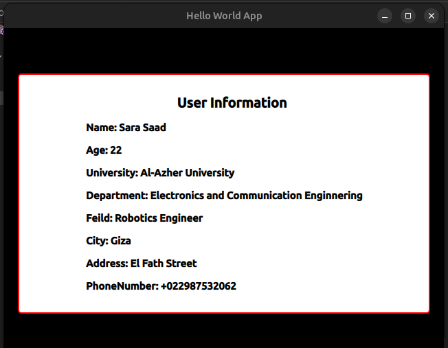

# Qt Quick User Information Application

A simple **Qt Quick / QML** application that demonstrates how to create a basic graphical user interface using **Qt Quick**, **Qt Quick Layouts**, and **Qt Quick Controls**.

The application displays user information inside a centered, styled rectangle, including the user's name, age, university, department, field, city, address, and phone number.

---

## 📌 Project Overview

This project is designed as a beginner-friendly introduction to **QML application development**.

It demonstrates:

- Creating an `ApplicationWindow`
- Defining properties in QML
- Using `Rectangle` as a container
- Organizing UI elements with `Column`
- Displaying information using `Text`
- Applying fonts and styling
- Using anchors for positioning
- Using `qsTr()` for translatable strings

---

## 🖥️ Application Information

The application displays:

- **Name:** Sara Saad
- **Age:** 22
- **University:** Al-Azher University
- **Department:** Electronics and Communication Engineering
- **Field:** Robotics Engineer
- **City:** Giza
- **Address:** El Fath Street
- **Phone Number:** +022987532062

---

## 🛠️ Technologies Used

| Technology | Purpose |
|---|---|
| **Qt** | Application framework |
| **QML** | User interface development |
| **Qt Quick** | UI components and application window |
| **Qt Quick Layouts** | Layout management |
| **Qt Quick Controls Basic** | Basic Qt controls |

---

## OutPut 


---
## 📂 Project Structure

```text
QtQuick-User-Information/
│
├── main.qml
└── README.md