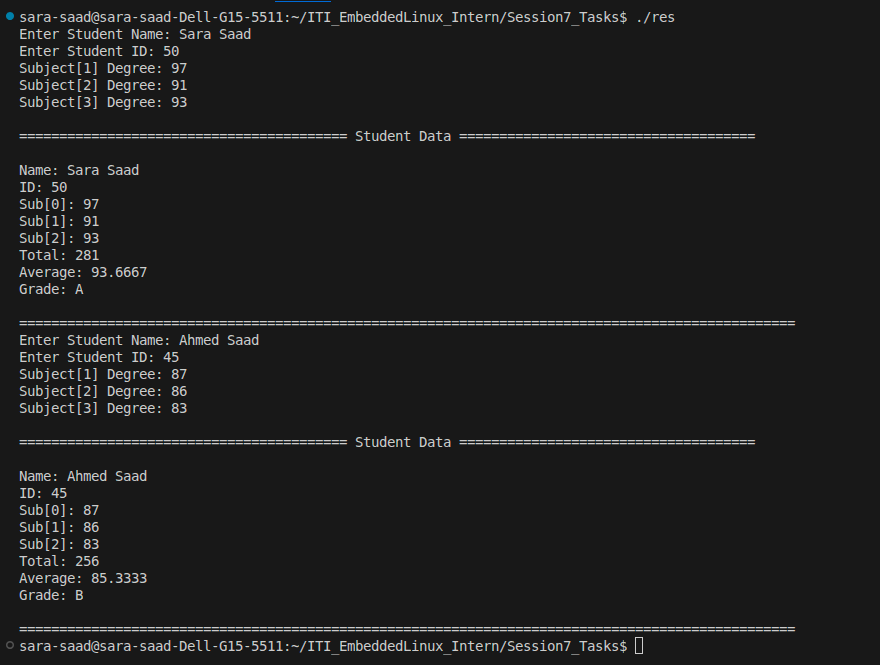

# Student Management System

A simple C++ console application that demonstrates the use of **Object-Oriented Programming (OOP)** concepts by implementing a **Student Management System**.

The program stores and manages student information, calculates the total and average marks, determines the final grade, and displays the student's academic record.

---

## Features

- Store student name.
- Store student ID.
- Store grades for three subjects.
- Calculate total marks.
- Calculate average marks.
- Assign a letter grade based on the average.
- Display complete student information.
- Demonstrate two different ways of initializing an object:
  - Using individual setter functions.
  - Using a single `setClassData()` function.

---

## Grade Scale

| Average | Grade |
|---------:|:-----:|
| > 90 | A |
| > 80 | B |
| > 70 | C |
| > 60 | D |
| ≤ 60 | F |

---

## Project Structure

```
.
├── main.cc
├── student_management.hh
├── student_management.cc
└── README.md
```

### File Description

| File | Description |
|------|-------------|
| `main.cc` | Reads user input and demonstrates the Student class. |
| `student_management.hh` | Declaration of the `Student` class. |
| `student_management.cc` | Implementation of the `Student` class methods. |

---

## Student Class

The `Student` class stores the following information:

- Student Name
- Student ID
- Subject Grades
- Total Marks
- Average Marks
- Letter Grade

### Public Member Functions

#### Constructors

- `Student()`

#### Getters

- `getStudentName()`
- `getStudentID()`
- `getSubjectDegree()`
- `getTotal()`
- `getAverage()`
- `getGrade()`

#### Setters

- `setStudentName()`
- `setStudentID()`
- `setSubjectDegree()`
- `setTotal()`
- `setAverage()`
- `setGarade()`
- `setClassData()`

#### Utility

- `printStudent()`

---

## Program Workflow

### Method 1

The first student object is initialized by calling each setter function separately.

```cpp
student1.setStudentName(...);
student1.setStudentID(...);
student1.setSubjectDegree(...);
student1.setTotal(...);
student1.setAverage(...);
student1.setGarade(...);
```

### Method 2

The second student object is initialized using a single function.

```cpp
student2.setClassData(name, id, degree);
```

This function internally initializes all student data.

---

## Example Output



---

## Build

Compile using **g++**:

```bash
g++ main.cc student_management.cc -o student_management
```

Run the program:

```bash
./student_management
```

---

## Concepts Used

- Classes and Objects
- Encapsulation
- Constructors
- Getter and Setter Functions
- Arrays
- Constant Member Functions
- Pointer Arithmetic
- Header Files
- Separate Compilation
- Input/Output Streams
- Doxygen Documentation

---

## Requirements

- C++11 or later
- GCC / G++
- Linux, Windows, or macOS

---

## Author

**Sara Saad**

Electronics and Communication Engineering  
Faculty of Engineering, Al-Azhar University

GitHub: https://github.com/SaraSaadMohamud

LinkedIn: https://www.linkedin.com/in/sara-saad-b7565a2b9/