# LINUX COURSE SESSION 1-2


> ```ASN.1
>    YOU (keyboard)
>         │
>         ▼
>  ┌──────────────────┐
>  │  Terminal / TTY  │   gnome-terminal, ssh session, Ctrl+Alt+F3
>  └──────────────────┘   Just a window that shows text and reads keys
>         │
>         ▼
>  ┌──────────────────┐
>  │   SHELL (bash)   │   Parses your line, expands wildcards & variables,
>  └──────────────────┘   sets up pipes/redirection, then forks + execs
>         │
>         ▼
>  ┌──────────────────┐
>  │  Program binary  │   /usr/bin/ls, /usr/bin/grep ...
>  └──────────────────┘   A normal ELF executable on disk
>         │  system calls (open, read, write, fork, execve...)
>         ▼
>  ┌──────────────────┐
>  │  LINUX KERNEL    │   The only thing allowed to touch hardware
>  └──────────────────┘   Memory, scheduling, filesystems, drivers, network
>         │
>         ▼
>  ┌──────────────────┐
>  │    HARDWARE      │
>  └──────────────────┘
> ```


#### Shell is not a Linux, it's just a program whose job to read line of text and launch another program.

#### System calls: This makes the "programs talk to the kernel" .

### In Linux everything is a File Directories, files, devices, drivers,...els.

---


### 1. Anatomy of a Command

```bash
    command   -a  --long-option   value   argument1  argument2
    ───┬───   ─┬─  ──────┬─────   ──┬──   ──────┬──────────────
       │       │         │          │           │
    program  short     long      option's    what to operate on
             flag      flag       value       (files, dirs, text)
```

Real example broken down:

```ABAP
ls -l -a --human-readable /var/log
│  │  │  │                └── argument: the directory to list
│  │  │  └── long option: readable sizes (4.0K instead of 4096)
│  │  └── short flag: show hidden files (dotfiles)
│  └── short flag: long listing format
└── the program
```


| Rule                                      | Example                                  |
| :---------------------------------------- | ---------------------------------------- |
| **Short flags = one dash, one letter**    | **`-l`**                                 |
| **Short flags can be bundled**            | **`ls -lah` == `ls -l -a -h`**           |
| **Long flags = two dashes, a word**       | **`--all`, `--human-readable`**          |
| **Long flag with value**                  | **`--block-size=M` or `--block-size M`** |
| **Short flag with value**                 | **`-n 5` or `-n5`**                      |
| **`--` means "no more flags after this"** | **`rm -- -weirdfile`**                   |
| **Order usually doesn't matter**          | **`ls -l /tmp` == `ls /tmp -l` (GNU)**   |

## **Why `--` matters:** if you have a file literally named `-rf`, then `rm -rf` would be read as flags. `rm -- -rf` deletes the file.


### Exit status — how commands report success

Every command returns a number: `0` = success, anything else = failure.

### Case sensitivity

Linux is **case sensitive**, always. `File.txt`, `file.txt`, and `FILE.TXT` are three different files. `-r` and `-R` are often two different flags (in `grep`, `-r` and `-R` differ on following symlinks).

---


## 2. Getting Help — The Most Important Skill

###  2.1 `man` — the manual pages

```bash
man ls
man chmod
man 5 passwd        # section 5: the FILE /etc/passwd
man 1 passwd        # section 1: the COMMAND passwd
```


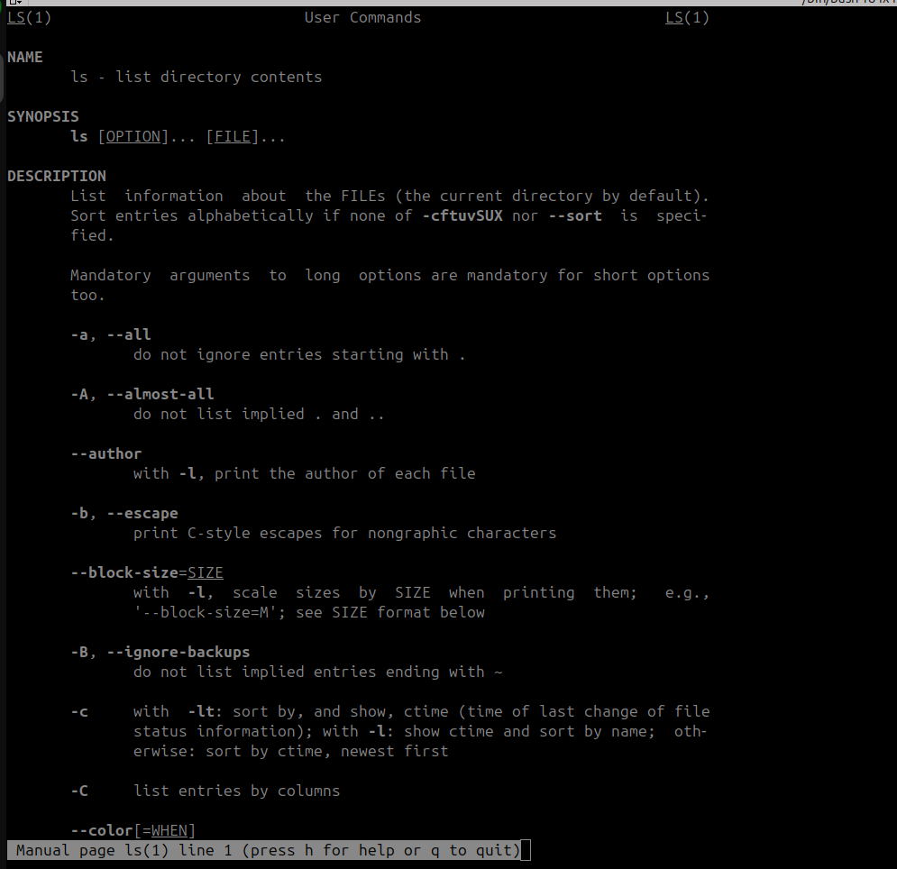


#### **Manual sections** (this trips up beginners constantly):

| Section | Contains                        |
| ------- | ------------------------------- |
| 1       | User commands                   |
| 2       | System calls (kernel)           |
| 3       | Library functions (C)           |
| 4       | Device / special files          |
| 5       | **File formats & config files** |
| 6       | Games                           |
| 7       | Misc / conventions              |
| 8       | **Sysadmin commands**           |

##### As an admin you'll live in sections **1, 5, and 8**.

#### **Reading a man page — the structure:**

```
NAME          one-line summary
SYNOPSIS      the grammar of the command  ← read this first
DESCRIPTION   what it does
OPTIONS       every flag explained        ← use /-flagname to jump
EXAMPLES      (not always present, but gold when it is)
EXIT STATUS   what the return codes mean
FILES         config files it reads
SEE ALSO      related commands            ← how you discover new tools
```

### 2.2 `--help` — the fast path

```
ls --help
ls --help | head -20
cp --help | grep -A2 recursive     # find the recursive flag + 2 lines after
```

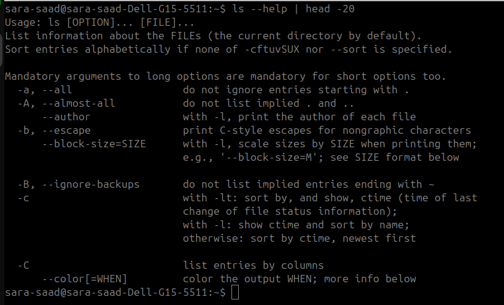

### 2.3 `apropos` / `man -k` — search when you don't know the command name

```
apropos "list directory"
apropos partition
apropos -s 8 network          # only section 8
man -k compress               # identical to apropos
man -k "change password"
```

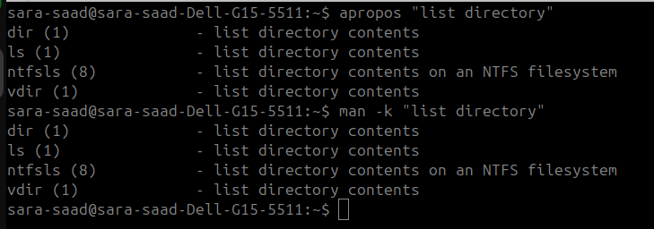

### 2.4 `whatis` — one-line description

```bash
whatis ls
# ls (1) - list directory contents

whatis passwd
# passwd (1)  - change user password
# passwd (5)  - the password file
```


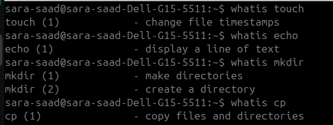

### 2.5 `type`, `which`, `whereis` — what am I actually running?

```bash
type cd            # cd is a shell builtin
type ls            # ls is aliased to `ls --color=auto'
type -a python3    # every match, in priority order
which grep         # /usr/bin/grep
whereis grep       # binary + source + man page locations
command -v ls      # POSIX-portable version of `which`
```


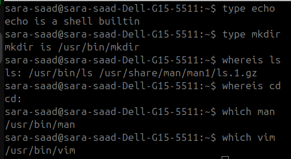


### 2.6 tldr practical examples, community-written

```bash
sudo apt install tldr -y
tldr tar
tldr find
tldr chmod
```


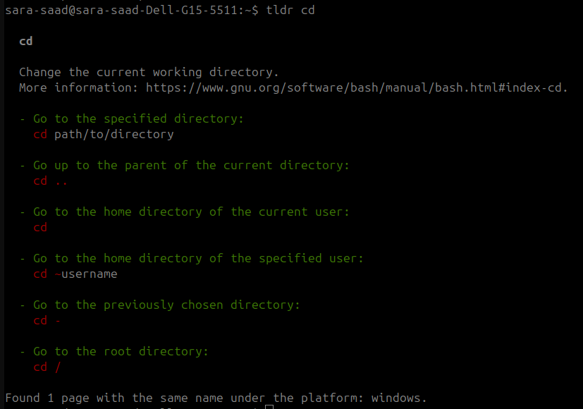

### Help cheat table

| I want to...                   | Command                     |
| ------------------------------ | --------------------------- |
| Full reference for a command   | `man cmd`                   |
| Quick flag reminder            | `cmd --help`                |
| Find a command by what it does | `apropos "keyword"`         |
| One-line "what is this?"       | `whatis cmd`                |
| Practical examples             | `tldr cmd`                  |
| Help for a shell builtin       | `help cmd`                  |
| Where does this binary live    | `which cmd` / `type -a cmd` |
| Config file format             | `man 5 filename`            |

---

## 3. The Filesystem Hierarchy (FHS)

#### Linux has **one** tree starting at `/`. There is no `C:\`. Extra disks get *mounted* into the tree as directories.

```
/
├── bin      → /usr/bin    Essential user commands (ls, cp, bash)
├── sbin     → /usr/sbin   System binaries (fdisk, iptables) — usually need root
├── lib      → /usr/lib    Shared libraries (.so files)
├── boot                   Kernel (vmlinuz), initramfs, GRUB config
├── dev                    Device files: sda, null, zero, random, tty
├── etc                    ★ ALL system config. Text files. Your home as an admin.
├── home                   Regular users' home dirs: /home/akhamees
├── root                   root user's home (NOT /home/root)
├── mnt                    Manual/temporary mount point
├── media                  Auto-mounted removable media (USB, CD)
├── opt                    Third-party / self-contained software
├── proc                   Virtual: live kernel + process info (not on disk)
├── sys                    Virtual: kernel device/driver interface
├── run                    Runtime state since boot (PID files, sockets)
├── srv                    Data served by this machine (www, ftp)
├── tmp                    Temp files, world-writable, wiped on reboot
├── usr                    User programs & read-only data
│   ├── bin   most commands        ├── lib   libraries
│   ├── sbin  admin commands       ├── share docs, man pages, icons
│   └── local ★ software YOU compile/install manually
└── var                    ★ Variable data that grows
    ├── log    ← system logs (syslog, auth.log) — you will live here
    ├── spool  ← queues (cron, mail, print)
    ├── cache  ← app caches, apt package cache
    ├── lib    ← app state (databases, dpkg records)
    └── www    ← web server files
```

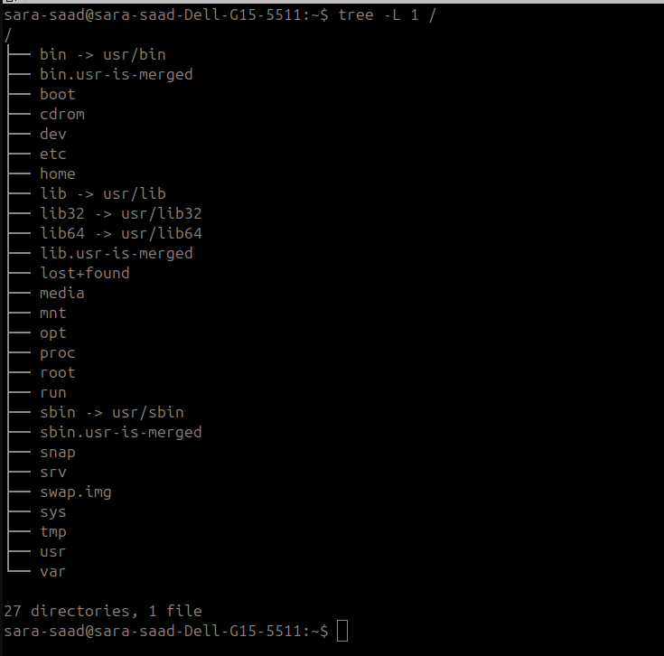

### Filename rules

- Anything except `/` and the NUL byte is legal in a name.

- A leading `.` makes it **hidden** (`.bashrc`) — nothing more magical than that.

- Extensions (`.txt`, `.sh`) are **conventions only**. Linux uses content, not the name.

- Avoid spaces; if you must, quote or escape: `"my file.txt"` or `my\ file.txt`.

  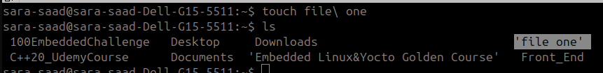


### Paths: absolute vs relative

```
/home/sara-saad/ITI_EmbeddedLinux_Intern    # ABSOLUTE — starts at /, works from anywhere
notes.txt                  					# RELATIVE — relative to current directory
./notes.txt                				    # explicitly "in current dir"
../sibling/file.txt         				# up one level, then down [parent]
~/notes.txt                				    # ~ = your home = /home/akhamees
~root/                      				# root's home
```


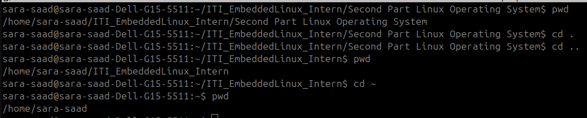


| Symbol  | Meaning                                |
| ------- | -------------------------------------- |
| `/`     | Root of the tree (or a path separator) |
| `.`     | Current directory                      |
| `..`    | Parent directory                       |
| `~`     | Current user's home                    |
| `~user` | That user's home                       |
| `-`     | Previous directory (with `cd`)         |

## 4. Navigation

### 4.1 pwd — print working directory

```
pwd            # /home/sara-saad
pwd -P         # resolve symlinks to the real physical path
pwd -L         # logical path (default, keeps symlinks)
```


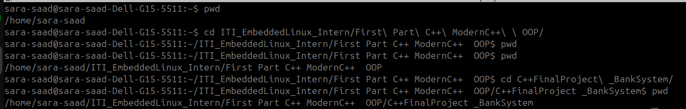


### 4.2 `cd` — change directory (a shell builtin)

```
cd /var/log         # absolute
cd log              # relative (if you're in /var)
cd ..               # up one
cd ../..            # up two
cd                  # → home (bare cd)
cd ~                # → home
cd -                # → previous directory (toggle!)
cd /var/log && pwd  # verify you arrived
```


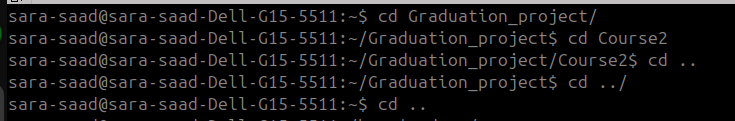

### 4.3 `ls` — list

#### Flags you must know:

| Flag | Meaning                                                     |
| ---- | ----------------------------------------------------------- |
| `-l` | Long format (perms, links, owner, group, size, mtime, name) |
| `-a` | All, including `.` hidden files                             |
| `-A` | Almost all — hidden but not `.` and `..`                    |
| `-h` | Human-readable sizes (use with `-l`)                        |
| `-t` | Sort by modification time, newest first                     |
| `-r` | Reverse sort order                                          |
| `-S` | Sort by file size                                           |
| `-R` | Recurse into subdirectories                                 |
| `-d` | The directory itself, not its contents                      |
| `-i` | Show inode numbers                                          |
| `-1` | One entry per line                                          |
| `-F` | Append type indicator: `/` dir, `*` exec, `@` symlink       |


```bash
ls
ls -l
ls -lh /var/log
ls -la ~                  # everything incl. dotfiles
ls -ltr /var/log          # oldest→newest: newest at BOTTOM, best for logs
ls -lS /var/log           # biggest files first
ls -ld /etc               # info about /etc itself
ls -li                    # with inode numbers
ls -R /etc/apt            # whole subtree
ls -F /                   # mark types
ls *.txt                  # glob: all .txt in cwd
ls /etc/*.conf            # glob with path
```


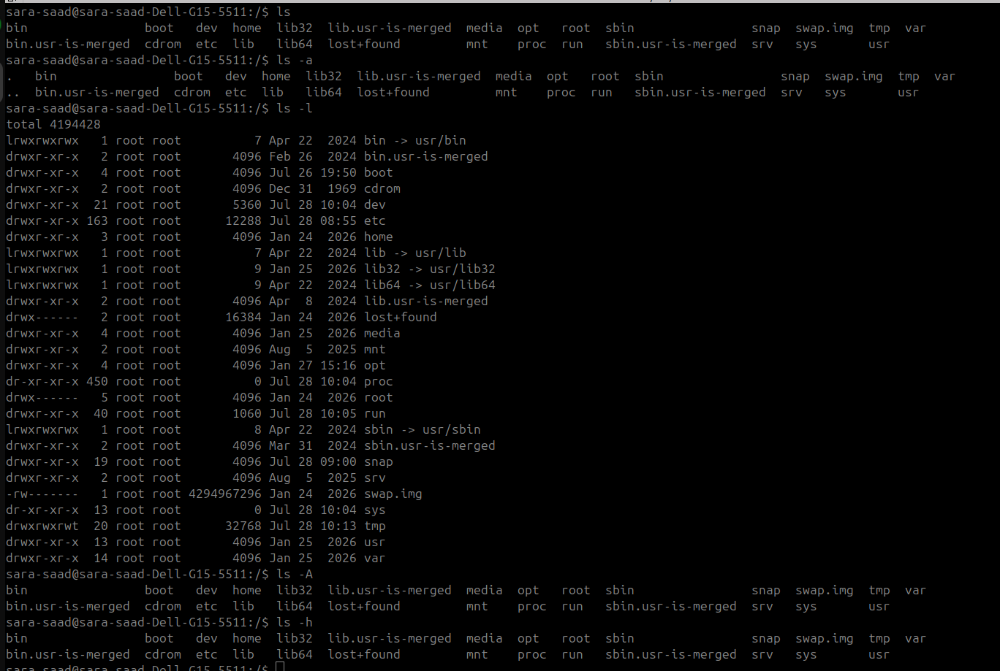

#### **Decoding `ls -l` output:**

```
-rw-r--r--  1   sara     sara    1234 Jul 26 17:24 notes.txt
│└┬┘└┬┘└┬┘  │ └───┬──┘ └───┬──┘  └─┬─┘ └────┬────┘ └───┬───┘
│ │  │  │   │     │        │       │        │          └─ name
│ │  │  │   │     │        │       │        └─ last modified
│ │  │  │   │     │        │       └─ size in bytes
│ │  │  │   │     │        └─ group owner
│ │  │  │   │     └─ user owner
│ │  │  │   └─ hard link count[no alias]
│ │  │  └─ others' permissions (r--)
│ │  └─ group's permissions (r--)
│ └─ owner's permissions (rw-)
└─ file type [-: regular file]
```


#### **File type characters (first column):**

| Char    | Type                              |
| ------- | --------------------------------- |
| **`-`** | **Regular file**                  |
| **`d`** | **Directory**                     |
| **`l`** | **Symbolic link**                 |
| **`c`** | **Character device (`/dev/tty`)** |
| **`b`** | **Block device (`/dev/sda`)**     |
| **`s`** | **Socket**                        |
| **`p`** | **Named pipe (FIFO)**             |


### 4.4 `tree` — visual hierarchy

```bash
sudo apt install tree -y
tree /etc/apt
tree -L 2 /var            # only 2 levels deep
tree -d /usr              # directories only
tree -a ~                 # include hidden
tree -h -L 1 /var         # with sizes
```

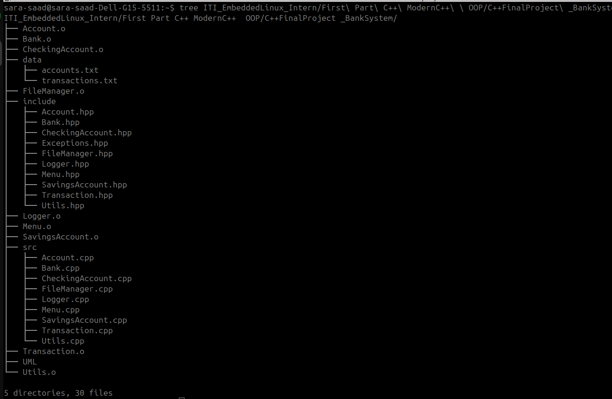


### 4.5 Globbing (wildcards) — expanded by the SHELL, not the command

```bash
ls *.txt          # * = any number of any chars (incl. none)
ls file?.txt      # ? = exactly one char
ls file[123].txt  # [] = one char from the set
ls file[1-5].txt  # ranges
ls file[!1].txt   # ! = NOT
ls *.{txt,log}    # brace expansion → *.txt *.log
touch file{1..5}.txt      # creates file1..file5 — sequences
mkdir -p proj/{src,docs,tests}/   # 3 dirs at once
echo *            # proves the shell expands it before the command runs
```

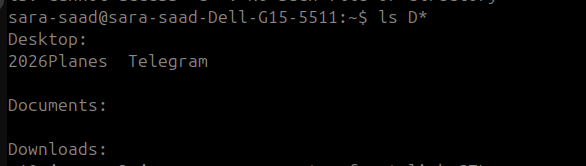

---

## 5. Creating, Copying, Moving, Deleting

### 5.1 `touch` — create empty file / update timestamps

```bash
touch newfile.txt
touch a.txt b.txt c.txt
touch file{1..10}.txt
touch -c existing.txt        # -c: don't create if missing, just update time
touch -t 202601011200 f.txt  # set a specific time (YYYYMMDDhhmm)
touch -d "2 days ago" f.txt
touch -r ref.txt target.txt  # copy ref.txt's timestamp onto target.txt
touch -a f.txt               # only access time
touch -m f.txt               # only modification time
```


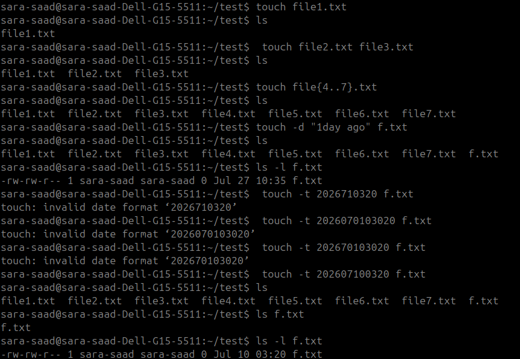

### 5.2 `mkdir` — make directories

```bash
mkdir projects
mkdir dir1 dir2 dir3
mkdir -p a/b/c/d             # -p: create parents as needed, no error if exists
mkdir -m 750 secure_dir      # -m: set permissions at creation
mkdir -pv a/b/c              # -v: verbose, print what was made
mkdir -p site/{css,js,img}   # combine with brace expansion
```

#### Linux Permission Values

| Number | Binary | Permission | Meaning              |
| ------ | ------ | ---------- | -------------------- |
| **7**  | 111    | `rwx`      | Read, Write, Execute |
| **6**  | 110    | `rw-`      | Read, Write          |
| **5**  | 101    | `r-x`      | Read, Execute        |
| **4**  | 100    | `r--`      | Read only            |
| **3**  | 011    | `-wx`      | Write, Execute       |
| **2**  | 010    | `-w-`      | Write only           |
| **1**  | 001    | `--x`      | Execute only         |
| **0**  | 000    | `---`      | No permissions       |


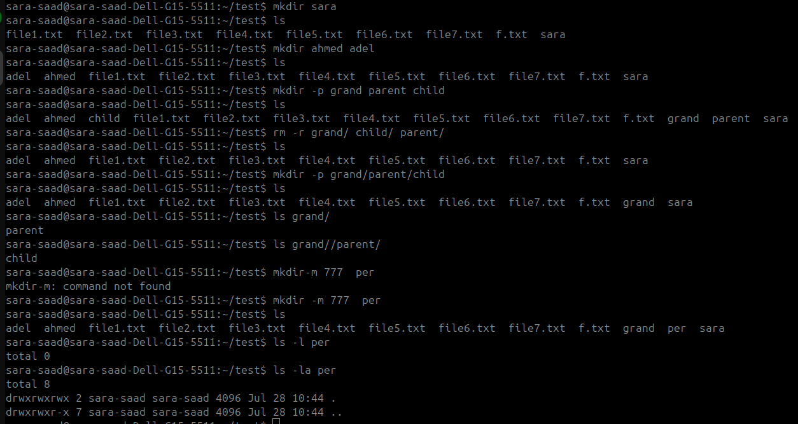


### 5.3 `cp` — copy

| Flag        | Meaning                                          |
| ----------- | ------------------------------------------------ |
| `-r` / `-R` | Recursive — **required** for directories         |
| `-i`        | Interactive — prompt before overwrite            |
| `-n`        | No-clobber — never overwrite                     |
| `-v`        | Verbose                                          |
| `-p`        | Preserve mode, ownership, timestamps             |
| `-a`        | Archive = `-dR --preserve=all` — the backup flag |
| `-u`        | Update — only if source is newer                 |
| `-l`        | Hard link instead of copying                     |
| `-s`        | Symlink instead of copying                       |

```bash
cp file.txt backup.txt
cp file.txt /tmp/                    # keep name, new dir
cp file1 file2 file3 /tmp/           # many → one dir
cp -r mydir /tmp/                    # directory
cp -av /etc/apt /tmp/apt-backup      # preserve everything + show progress
cp -i important.txt /tmp/            # ask before clobbering
cp file.txt{,.bak}                   # brace trick → cp file.txt file.txt.bak
cp -u src/* dest/                    # sync only newer files
```


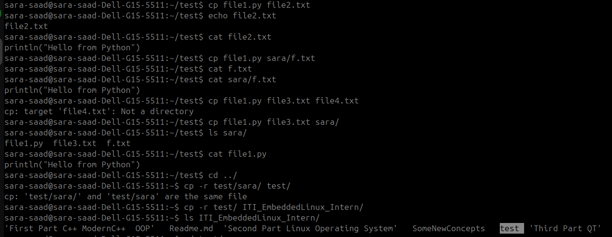