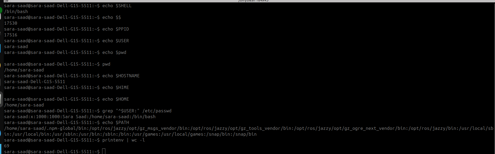

# 🕵️ Linux Detective Report

## Bouns 2 – Become the Linux Detective

### Objective

The objective of this assignment is to investigate the current Linux shell environment using built-in Linux commands without relying on external resources. The report includes the commands used, their outputs, and a brief explanation of each piece of information.

---

## 1. Current Shell

### Command

```bash
echo $SHELL
```

### Example Output

```text
/bin/bash
```

### Explanation

Displays the path of the default shell currently being used by the user.

---

## 2. Shell PID

### Command

```bash
echo $$
```

### Example Output

```text
12345
```

### Explanation

Displays the **Process ID (PID)** of the current shell. Every running process in Linux has a unique PID.

---

## 3. Parent PID

### Command

```bash
echo $PPID
```

### Example Output

```text
987
```

### Explanation

Displays the **Parent Process ID (PPID)**, which is the process that started the current shell.

---

## 4. Current User

### Command

```bash
echo $USER
```

or

```bash
whoami
```

### Example Output

```text
sara-saad
```

### Explanation

Displays the username of the currently logged-in user.

---

## 5. Current Working Directory

### Command

```bash
pwd
```

### Example Output

```text
/home/sara-saad
```

### Explanation

Displays the **Present Working Directory (PWD)**, which is the directory where the user is currently working.

---

## 6. Home Directory

### Command

```bash
echo $HOME
```

### Example Output

```text
/home/sara-saad
```

### Explanation

Displays the user's home directory, which is the default directory after logging into the system.

---

## 7. Hostname

### Command

```bash
hostname
```

### Example Output

```text
sara-saad-Dell-G15-5511
```

### Explanation

Displays the hostname of the current Linux system.

---

## 8. Login Shell

### Command

```bash
grep "^$USER:" /etc/passwd
```

### Example Output

```text
sara-saad:x:1000:1000:Sara Saad:/home/sara-saad:/bin/bash
```

### Login Shell

```text
/bin/bash
```

### Explanation

The last field in the `/etc/passwd` file specifies the default login shell assigned to the user.

---

## 9. PATH Environment Variable

### Command

```bash
echo $PATH
```

### Example Output

```text
/usr/local/sbin:/usr/local/bin:/usr/sbin:/usr/bin:/sbin:/bin
```

### Explanation

Displays the list of directories that Linux searches when executing commands without specifying their full path.

---

## 10. Number of Environment Variables

### Command

```bash
printenv | wc -l
```

### Example Output

```text
48
```

### Explanation

- `printenv` displays all environment variables.
- `wc -l` counts the number of lines.
- The result represents the total number of environment variables currently available.

---

# Screenshot


# Summary

| Item | Command |
|------|---------|
| Current Shell | `echo $SHELL` |
| Shell PID | `echo $$` |
| Parent PID | `echo $PPID` |
| Current User | `echo $USER` or `whoami` |
| Current Working Directory | `pwd` |
| Home Directory | `echo $HOME` |
| Hostname | `hostname` |
| Login Shell | `grep "^$USER:" /etc/passwd` |
| PATH | `echo $PATH` |
| Number of Environment Variables | `printenv \| wc -l` |

---

## Conclusion

This investigation provided detailed information about the current Linux shell environment using standard Linux commands. It covered the shell type, process identifiers, user information, directory paths, hostname, login shell, executable search path, and the total number of environment variables available in the current session.

