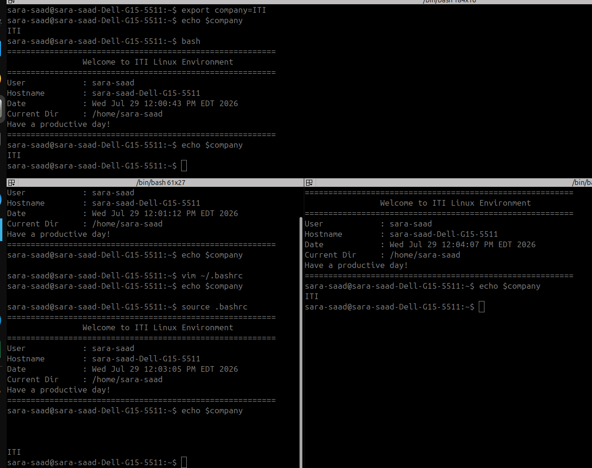

# Bouns 1– Environment Variable Mystery

## Objective

The objective of this assignment is to create a persistent environment variable named `company` with the value `ITI`, verify its existence, and ensure that it is automatically loaded whenever a new terminal session starts.

---

# Step 1 – Verify the Variable Before Creation

First, I checked whether the environment variable already existed.

### Command

```bash
echo $company
```

### Output

```text

```

Since no value was returned, the variable did not exist.

---

# Step 2 – Edit the Bash Startup File

To make the variable persistent, I edited the Bash startup configuration file.

### Command

```bash
vim ~/.bashrc
```

Then I added the following line at the end of the file:

```bash
export company=ITI
```

After saving the file, I exited Vim.

---

# Step 3 – Reload the Configuration

Instead of restarting the terminal, I reloaded the `.bashrc` file.

### Command

```bash
source ~/.bashrc
```

Reloading the file immediately applies the new environment variable.

---

# Step 4 – Verify the Variable

I verified that the variable had been successfully created.

### Command

```bash
echo $company
```

### Output

```text
ITI
```

This confirms that the environment variable was successfully loaded.

---

# Step 5 – Verify Persistence

I opened a new terminal window.

### Command

```bash
echo $company
```

### Output

```text
ITI
```

The variable still exists after opening a new terminal, proving that it is persistent.

---

# Why I Modified `.bashrc`

I modified the `~/.bashrc` file because it is executed automatically whenever a new interactive Bash shell starts.

Adding the following line:

```bash
export company=ITI
```

ensures that the environment variable is available every time a new terminal is opened.

---

# Commands Used

```bash
# Check whether the variable exists
echo $company

# Edit the Bash startup file
vim ~/.bashrc

# Add the following line
export company=ITI

# Reload the configuration
source ~/.bashrc

# Verify the variable
echo $company
```

---

# Result

- Successfully created the environment variable.
- Verified that it exists.
- Made the variable persistent.
- Confirmed that it is automatically available in every new terminal session.

---

# Screenshot of Proccess


