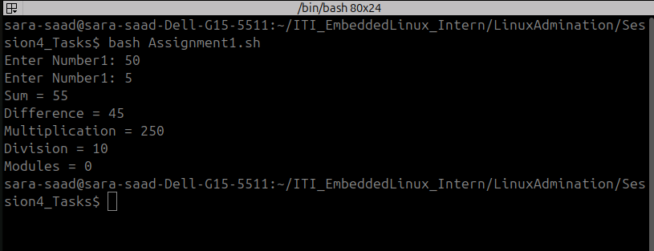
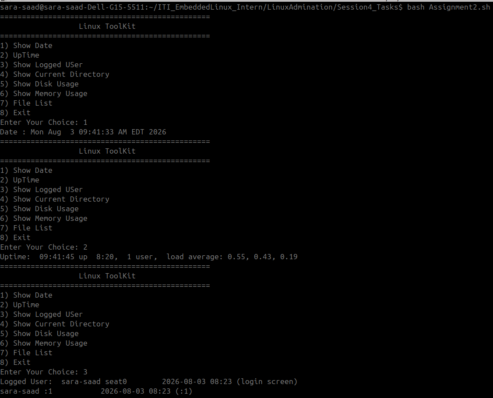
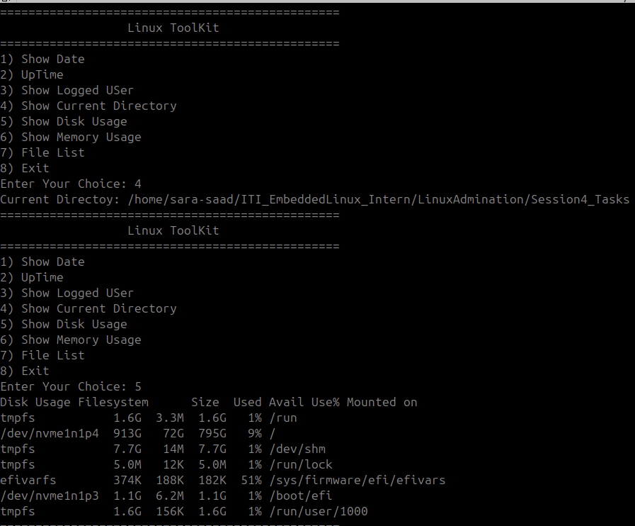
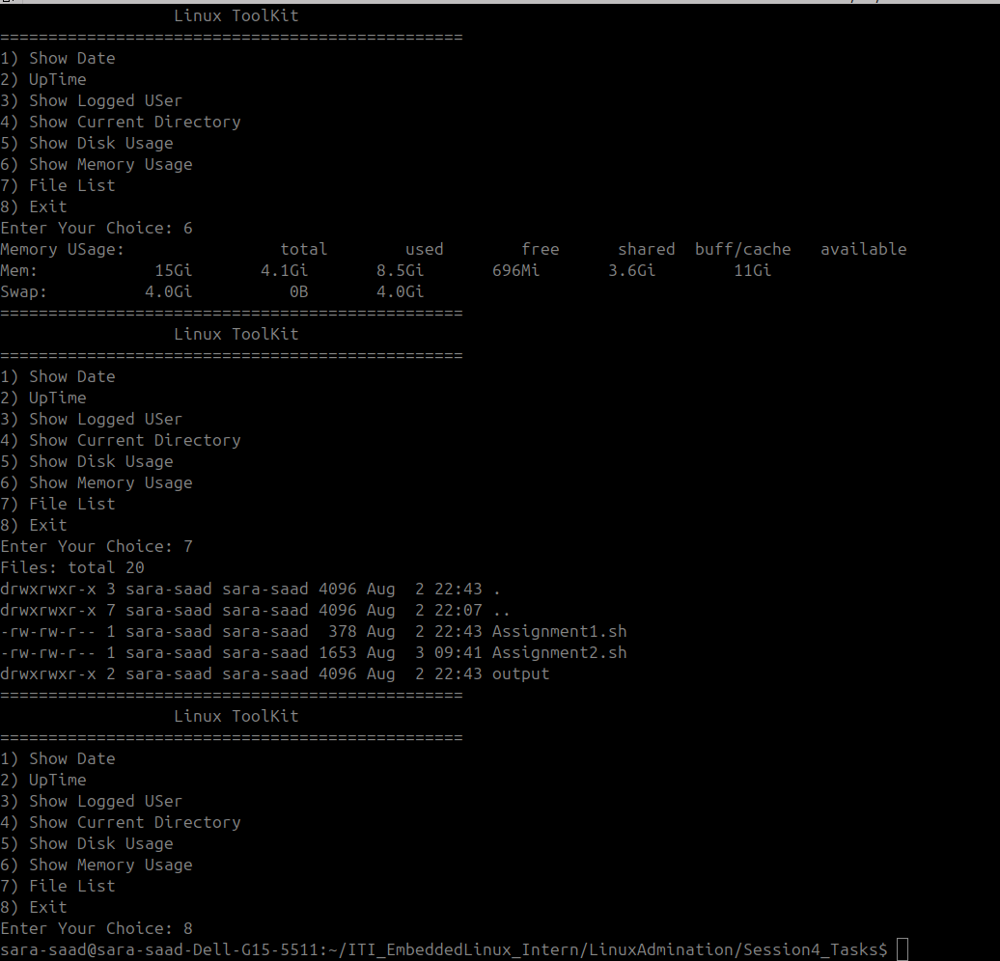
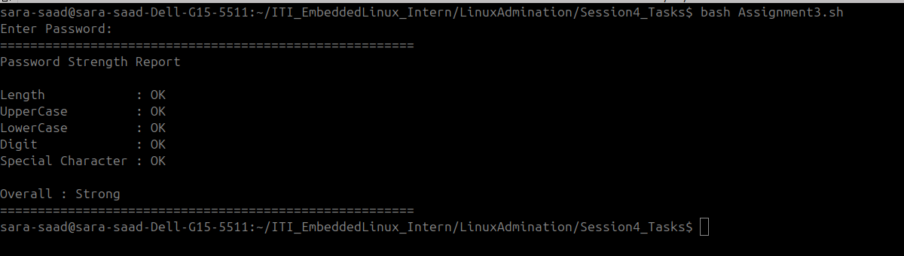

# Bash Programming Assignments

A collection of beginner-to-intermediate **Bash scripting assignments** focused on Linux command-line programming, shell syntax, functions, loops, conditions, variables, command substitution, and pattern matching.

These assignments were completed as part of Linux/Bash programming practice.

---

## 📌 Assignments Overview

| Assignment | Title | Main Concepts |
|---|---|---|
| 1 | Arithmetic Operations | Variables, user input, arithmetic expansion |
| 2 | Mini Linux System Monitor | Functions, loops, `case`, command substitution, variables |
| 3 | Password Strength Checker | String length, pattern matching, conditions |

---

## 📂 Project Structure

```text
Bash-Assignments/
│
├── Assignment1.sh
├── Assignment2.sh
├── Assignment3.sh
│
├── Assignment1.png
├── Assignment2_1.png
├── Assignment2_2.png
├── Assignment2_3.png
├── Assignment3.png
│
└── README.md
```

> File names may vary depending on the organization of the submitted assignment folder.

---

## 1. Arithmetic Operations

### 🎯 Objective

Create a Bash script that asks the user to enter two integers and performs the following arithmetic operations:

- Addition
- Subtraction
- Multiplication
- Integer Division
- Modulus

### 🧠 Concepts Practiced

- `read` for user input
- Shell variables
- Arithmetic expansion `$((...))`
- Basic arithmetic operators
- `echo` for formatted output

### ⚙️ Operations

| Operation | Bash Operator |
|---|---|
| Addition | `+` |
| Difference | `-` |
| Multiplication | `*` |
| Division | `/` |
| Modulus | `%` |

### ▶️ Example

```text
Enter Number1: 20
Enter Number1: 5

Sum = 25
Difference = 15
Multiplication = 100
Division = 4
Modules = 0
```

### ▶️ Run

```bash
chmod +x Assignment1.sh
./Assignment1.sh
```

> **Note:** Bash arithmetic uses integer arithmetic. Division between integers produces an integer result.

---

## 2. Mini Linux System Monitor

### 🎯 Objective

Build a menu-driven Linux toolkit that provides quick access to common system and shell information.

### 🖥️ Menu

```text
================================================
                  Linux ToolKit
================================================
1) Show Date
2) UpTime
3) Show Logged User
4) Show Current Directory
5) Show Disk Usage
6) Show Memory Usage
7) File List
8) Exit
```

### 🧠 Concepts Practiced

- Bash functions
- `while` loops
- `case` statements
- Variables
- Command substitution
- Input validation
- Linux system commands

### 🔧 Implemented Functions

| Function | Purpose | Command |
|---|---|---|
| `Date()` | Displays current date and time | `date` |
| `Uptime()` | Displays system uptime | `uptime` |
| `LoggedUser()` | Displays logged-in users | `who` |
| `CurrentDirectory()` | Displays the current directory | `pwd` |
| `ShowingDiskUsage()` | Displays filesystem disk usage | `df -h` |
| `ShowMemoryUsage()` | Displays memory information | `free -h` |
| `FileList()` | Displays files and directories | `ls -la` |
| `Exit()` | Terminates the script | `exit 0` |

### 🔄 Program Flow

1. Display the Linux Toolkit menu.
2. Ask the user to enter an option.
3. Validate the selected option.
4. Allow up to three invalid attempts.
5. Use `case` to execute the selected function.
6. Return to the menu after completing an operation.
7. Exit when option 8 is selected.

### ▶️ Run

```bash
chmod +x Assignment2.sh
./Assignment2.sh
```

---

## 3. Password Strength Checker

### 🎯 Objective

Create a Bash script that evaluates a password based on several security requirements.

The script checks whether the password contains:

- At least 8 characters
- At least one uppercase letter
- At least one lowercase letter
- At least one digit
- At least one special character

The password is classified as:

- **Strong** — all requirements are satisfied
- **Weak** — one or more requirements are missing

### 🧠 Concepts Practiced

- String length
- Pattern matching
- Regular expressions
- Conditional statements
- `[[ ... ]]`
- Bash variables
- Silent input using `read -s`

### 🔐 Validation Rules

| Requirement | Technique |
|---|---|
| Minimum length | `${#password}` |
| Uppercase letter | `[A-Z]` |
| Lowercase letter | `[a-z]` |
| Digit | `[0-9]` |
| Special character | Character pattern matching |

### 📊 Example Output

```text
=======================================================
Password Strength Report

Length            : OK
UpperCase         : OK
LowerCase         : OK
Digit             : OK
Special Character : OK

Overall : Strong
=======================================================
```

### ▶️ Run

```bash
chmod +x Assignment3.sh
./Assignment3.sh
```

> The password is entered using silent input so that it is not displayed in the terminal.

---

## 🛠️ Technologies & Tools

- Bash
- Linux / Ubuntu
- GNU/Linux Command Line
- Terminal
- VS Code

### Commands Used

```text
date
uptime
who
pwd
df
free
ls
```

---

## 📚 Bash Concepts Covered

Across the three assignments, the project demonstrates practical usage of:

- Shell scripting fundamentals
- Variables
- User input with `read`
- Arithmetic expansion
- Functions
- `if / else`
- `case`
- `while` loops
- Command substitution `$(...)`
- String length `${#variable}`
- Pattern matching with `=~`
- Regular expressions
- Input validation
- Exit status
- Linux system commands

---

## 🚀 How to Run the Assignments

Clone or download the project, then navigate to the assignment directory:

```bash
cd Bash-Assignments
```

Make the scripts executable:

```bash
chmod +x Assignment1.sh Assignment2.sh Assignment3.sh
```

Run any assignment:

```bash
./Assignment1.sh
```

or:

```bash
./Assignment2.sh
```

or:

```bash
./Assignment3.sh
```

---

## 📸 Screenshots

Screenshots demonstrating the execution of the assignments are included in the repository.

### Assignment 1 — Arithmetic Operations


### Assignment 2 — Mini Linux System Monitor




### Assignment 3 — Password Strength Checker


---

## 🎓 Learning Outcomes

After completing these assignments, the following Bash/Linux skills were practiced:

- Writing executable Bash scripts
- Receiving and processing user input
- Performing integer arithmetic
- Building reusable Bash functions
- Creating interactive command-line menus
- Validating user input
- Working with Linux system information
- Applying regular expressions for password validation
- Combining multiple Bash concepts into complete scripts

---

## 👩‍💻 Author

**Sara Saad Mahmoud**
Electronics & Communication Engineering
Linux & Embedded Systems Practice

---
