<div align="center">

# 🏦 Bank Management System

### A Modern, Object-Oriented Banking Simulation Engine Built in C++20

*A console-based banking platform that models real-world financial operations — account management, transactions, authentication, and persistent storage — through clean, extensible, and idiomatic Object-Oriented design.*

[](https://en.cppreference.com/w/cpp/20)
[](#object-oriented-design)
[](#project-overview)
[](#persistent-storage)
[](#build-instructions)
[](#license)

</div>

---

## 📖 Table of Contents

1. [Project Overview](#-project-overview)
2. [Features](#-features)
3. [Technologies Used](#-technologies-used)
4. [Project Structure](#-project-structure)
5. [System Architecture](#-system-architecture)
6. [Object-Oriented Design](#-object-oriented-design)
7. [Class Responsibilities](#-class-responsibilities)
8. [Account Hierarchy](#-account-hierarchy)
9. [Authentication System](#-authentication-system)
10. [Account Types](#-account-types)
11. [Banking Operations](#-banking-operations)
12. [Transaction System](#-transaction-system)
13. [Persistent Storage](#-persistent-storage)
14. [Exception Handling](#-exception-handling)
15. [Modern C++ Features](#-modern-c-features)
16. [Design Decisions](#-design-decisions)
17. [Sample Workflow](#-sample-workflow)
18. [Possible Improvements](#-possible-improvements)
19. [Build Instructions](#-build-instructions)
20. [Screenshots](#-screenshots)
21. [UML Diagrams](#-uml-diagrams)
22. [Author](#-author)
23. [License](#-license)

---

## 🧭 Project Overview

**Bank Management System** is a fully object-oriented, console-driven simulation of a retail banking platform, engineered in **Modern C++20**. It goes beyond a simple CRUD demo — it models the core lifecycle of a financial institution: account creation, authenticated access, monetary operations, transaction logging, and durable persistence across application runs.

The project was built with one central goal in mind: **to demonstrate how sound Object-Oriented Programming principles translate into a maintainable, extensible, real-world software system**, rather than a flat, procedural script that happens to compile.

### Why This Project Exists

Most introductory banking-system exercises stop at "deposit and withdraw." This project intentionally goes further by addressing the same architectural questions a production system has to answer:

- How do you model **different account types** that share behavior but diverge in business rules (interest vs. overdraft)?
- How do you guarantee **data survives** a process restart without a database engine?
- How do you keep a growing **transaction ledger** consistent, auditable, and queryable?
- How do you separate **administrative** capability from **customer-facing** capability?
- How do you fail **safely and predictably** when a user provides bad input, insufficient funds, or a duplicate account?

### Problems It Solves

| Problem | How the System Addresses It |
|---|---|
| Financial data must survive application restarts | Custom lightweight file-based persistence layer (`data/accounts.txt`, `data/transactions.txt`) |
| Different account types need different business rules | Abstract `Account` base class with polymorphic `SavingsAccount` / `CheckingAccount` subclasses |
| Operations must be auditable | Every deposit, withdrawal, and transfer automatically generates an immutable `Transaction` record |
| Unvalidated input can corrupt state | Centralized exception-based validation at every entry point |
| IDs must remain unique across sessions | Static ID counters that continue incrementing correctly after reload |
| Admins and customers need different privilege levels | Role-based menu separation (`Admin` vs. `User`) built on a shared `Login` authentication flow |

The result is a compact but architecturally honest system — small enough to read in an afternoon, but structured the way a much larger financial application would be.

---

## ✨ Features

| Category | Description |
|---|---|
| 🔐 **Authentication** | Role-based login system for Admins and Users, with bounded retry attempts and credential validation. |
| 🏦 **Banking Operations** | Full support for account creation, account removal, deposits, withdrawals, and inter-account transfers. |
| 💾 **Persistent Storage** | Automatic save/load of accounts and transactions to plain-text data files on every state change. |
| 🧾 **Transaction History** | Every monetary operation is logged with a unique ID, type, amount, timestamp, and involved account(s). |
| 📊 **Transaction Statistics** | Aggregated reporting of total deposits, withdrawals, transfers, and overall transaction count. |
| 🧬 **Dynamic Polymorphism** | `Account` acts as a polymorphic base; `SavingsAccount` and `CheckingAccount` override behavior via virtual dispatch. |
| 🧱 **OOP Design** | Encapsulation, inheritance, abstraction, and dynamic binding applied consistently across the codebase. |
| 🚨 **Exception Handling** | Centralized validation using `std::invalid_argument` / `std::runtime_error` for all failure paths. |
| 🆔 **Persistent ID Continuity** | Static counters for Account IDs and Transaction IDs correctly resume after reloading from disk. |
| 🖥️ **Interactive Console Menus** | Separate, guided menu flows for Admin and User roles with input-retry safeguards. |
| 📁 **Modular File Layout** | Clear separation between headers, source files, and persisted data for maintainability. |

---

## 🛠️ Technologies Used

| Technology / Concept | Purpose in the Project |
|---|---|
| **C++20** | Core implementation language; leverages modern language features and standard library facilities. |
| **STL (Standard Template Library)** | `std::vector` for account/transaction collections, `std::string` for textual data. |
| **File Streams (`<fstream>`)** | `std::ifstream` / `std::ofstream` used to persist and restore accounts and transactions. |
| **String Streams (`<sstream>`)** | Parsing delimited fields from persisted text records during load operations. |
| **Dynamic Memory Management** | `Account` objects are heap-allocated and owned by `Bank`, released in its destructor. |
| **Runtime Polymorphism** | Virtual functions and `dynamic_cast` distinguish `SavingsAccount` from `CheckingAccount` at runtime. |
| **Exception Handling (`<stdexcept>`)** | `std::invalid_argument` and `std::runtime_error` enforce correctness at every operation boundary. |
| **Doxygen-Style Documentation** | File-level and function-level documentation blocks describing purpose, parameters, and behavior. |

---

## 📂 Project Structure

```text
BankManagementSystem
│
├── include/                # Public headers — class declarations & interfaces
│   ├── Account.hpp
│   ├── Bank.hpp
│   ├── Transaction.hpp
│   ├── SavingsAccount.hpp
│   ├── CheckingAccount.hpp
│   ├── Login.hpp
│   ├── Admin.hpp
│   ├── User.hpp
│   └── Utilities.hpp
│
├── src/                     # Implementation files
│   ├── main.cpp
│   ├── Bank.cpp
│   ├── Account.cpp
│   ├── Transaction.cpp
│   ├── SavingsAccount.cpp
│   ├── CheckingAccount.cpp
│   ├── Login.cpp
│   ├── Admin.cpp
│   └── User.cpp
│
├── data/                    # Persisted application state (auto-generated)
│   ├── accounts.txt
│   └── transactions.txt
│
├── UML/                     # UML diagrams describing system design
│   └── (class diagrams, sequence diagrams)
│
└── README.md                # Project documentation (this file)
```

| Folder | Purpose |
|---|---|
| `include/` | Contains all class interfaces (`.hpp` files). Keeping declarations separate from implementation supports faster compilation and a clean public API surface. |
| `src/` | Contains the actual logic (`.cpp` files) implementing each class declared in `include/`. |
| `data/` | Runtime-generated persistence layer. Automatically created and updated as accounts and transactions change — acts as the system's lightweight "database." |
| `UML/` | Houses design diagrams (class hierarchy, sequence flows) used during architecture planning and documentation. |
| `README.md` | This document — full project documentation. |

---

### 📦 Package Structure

This package diagram illustrates the high-level organization of the project into modules and their relationships.

<p align="center">
    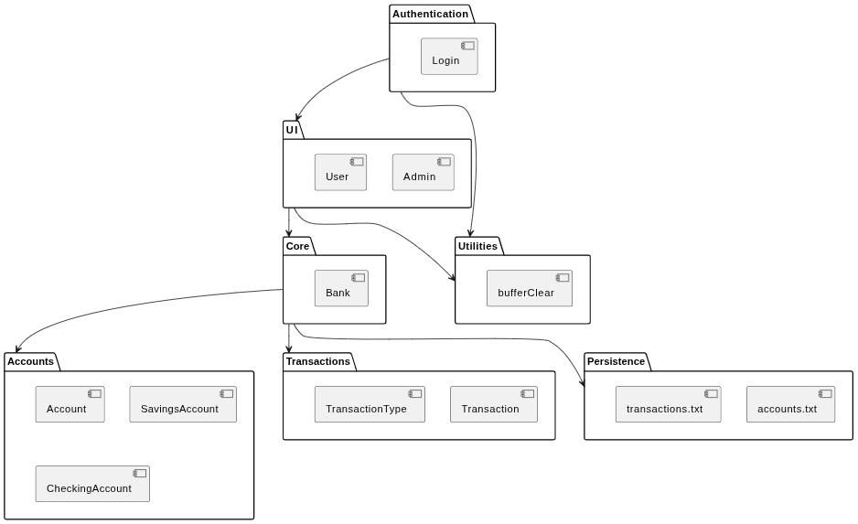
</p>

## 🏗️ System Architecture

The application follows a strictly layered control flow, where each layer only depends on the layer directly beneath it:

```text
                ┌─────────────┐
                │    main()   │
                └──────┬──────┘
                       │
                       ▼
                ┌─────────────┐
                │    Login    │  ← Authenticates the actor
                └──────┬──────┘
                       │
             ┌─────────┴─────────┐
             ▼                   ▼
       ┌───────────┐       ┌───────────┐
       │   Admin   │       │    User   │  ← Role-specific menu & permissions
       └─────┬─────┘       └─────┬─────┘
             │                   │
             └─────────┬─────────┘
                        ▼
                 ┌─────────────┐
                 │     Bank    │  ← Central orchestrator
                 └──────┬──────┘
                        │
             ┌──────────┴───────────┐
             ▼                      ▼
      ┌─────────────┐       ┌───────────────┐
      │   Account   │       │  Transaction  │
      │ (polymorphic)│      │    (ledger)   │
      └─────────────┘       └───────────────┘
```

`Bank` is the single point of coordination: it owns the collection of `Account` objects, maintains the `Transaction` ledger, and mediates every interaction between the menu layer and the domain layer. Neither `Admin` nor `User` ever touches an `Account` object directly — every operation is routed through `Bank`'s public API, which is the layer responsible for validation, persistence, and consistency.

### Deployment Diagram

The deployment diagram illustrates how the executable interacts with the operating system and persistent storage.

<p align="center">
    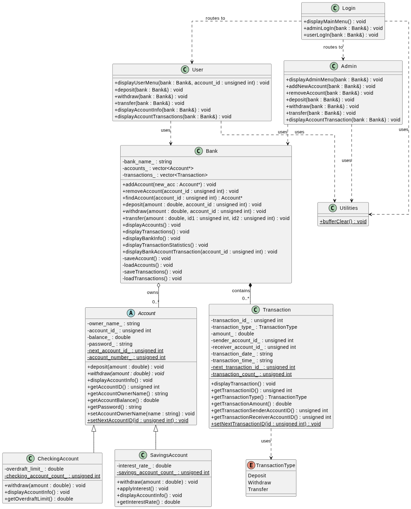
</p>

---

## 🧩 Object-Oriented Design

The system is deliberately structured to showcase all four pillars of Object-Oriented Programming, not as an academic exercise, but because each pillar solves a concrete problem in this domain.

| Pillar | Applied Where | Why It Matters Here |
|---|---|---|
| **Encapsulation** | `Account` keeps balance, owner name, password, and ID as private members, exposed only through controlled getters and validated mutators (`deposit`, `withdraw`). | Prevents any external code from corrupting account state directly — every balance change is funneled through validated logic. |
| **Abstraction** | `Bank` exposes a small, intention-revealing public API (`deposit`, `withdraw`, `transfer`, `addAccount`) and hides file I/O, ID resolution, and ledger bookkeeping. | Callers (menus) reason about *what* to do, not *how* it's persisted or validated. |
| **Inheritance** | `SavingsAccount` and `CheckingAccount` both derive from an abstract `Account` base class. | Shared behavior (balance tracking, owner identity) lives once, in the base class; specialized rules live in each subclass. |
| **Polymorphism (Dynamic Binding)** | `Bank` stores accounts as `Account*` and relies on virtual dispatch (and `dynamic_cast` for persistence) to apply the correct behavior for each concrete account type. | New account types can be introduced without modifying `Bank`'s core operational logic. |

### Class Structure

The following UML diagram shows the complete class relationships used in the project.

<p align="center">
    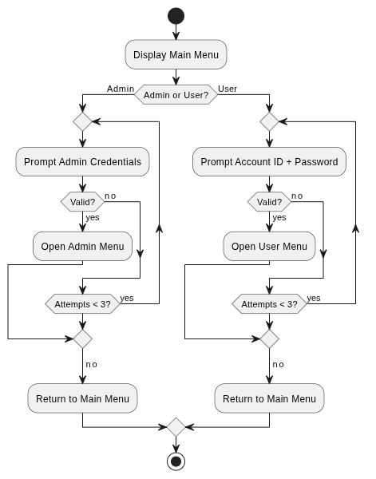
</p>
---

## 🧱 Class Responsibilities

| Class | Purpose | Key Responsibilities | Relationships | Important Methods |
|---|---|---|---|---|
| **`Account`** | Abstract base representing a generic bank account. | Owns balance, owner name, password, and a unique account ID; defines the contract every account type must fulfill. | Base class for `SavingsAccount` and `CheckingAccount`; owned and managed by `Bank`. | `deposit()`, `withdraw()`, `getAccountID()`, `getAccountBalance()`, `displayAccountInfo()` |
| **`Bank`** | Central orchestrator and system-of-record. | Owns the account collection and transaction ledger; performs validation; coordinates persistence; exposes the sole public API for all banking operations. | Aggregates many `Account*`; aggregates many `Transaction` objects. | `addAccount()`, `removeAccount()`, `findAccount()`, `deposit()`, `withdraw()`, `transfer()`, `saveAccount()`, `loadAccounts()`, `saveTransactions()`, `loadTransactions()` |
| **`Transaction`** | Immutable record of a single monetary event. | Stores transaction ID, type, amount, date, time, sender ID, and receiver ID. | Created and owned by `Bank`; references `Account` IDs (not pointers) to remain persistence-friendly. | `getTransactionType()`, `getTransactionAmount()`, `displayTransaction()` |
| **`SavingsAccount`** | Concrete account type modeling interest-bearing savings. | Enforces a minimum balance rule; stores and applies an interest rate. | Inherits from `Account`. | `getInterestRate()`, overridden `withdraw()` |
| **`CheckingAccount`** | Concrete account type modeling everyday transactional banking. | Permits controlled negative balances up to an overdraft limit. | Inherits from `Account`. | `getOverdraftLimit()`, overridden `withdraw()` |
| **`Login`** | Authentication gateway for the entire application. | Prompts for credentials, validates against stored records, enforces a maximum retry count, and determines role. | Invoked by `main()`; hands control to `Admin` or `User` on success. | `authenticate()`, `validateCredentials()` |
| **`Admin`** | Administrative control surface. | Presents the admin menu; permits account creation/removal, deposits, withdrawals, transfers, and full reporting across all accounts. | Operates exclusively through `Bank`'s public API. | `displayAdminMenu()`, `addNewAccount()`, `removeAccount()`, `deposit()`, `withdraw()`, `transfer()` |
| **`User`** | Customer-facing control surface. | Presents a restricted menu scoped to the authenticated user's own account — balance inquiry, deposits, withdrawals, and personal transaction history. | Operates exclusively through `Bank`'s public API, scoped by account ownership. | `displayUserMenu()`, `viewBalance()`, `viewTransactionHistory()` |
| **`Utilities`** | Shared, stateless helper functions. | Provides input-buffer clearing, generic input validation loops, and other cross-cutting helpers used by both `Admin` and `User` menus. | Used by `Admin`, `User`, and `Login`. | `bufferClear()`, input-validation helpers |

---

## 🌳 Account Hierarchy

```text
                     Account
                   (abstract)
                        │
         ┌──────────────┴──────────────┐
         ▼                             ▼
  SavingsAccount                CheckingAccount
```

`Account` defines the shared contract — identity, balance, and the general shape of `deposit`/`withdraw` — but does not know how a withdrawal should be limited. That decision is deferred to the subclasses:

- **`SavingsAccount`** overrides withdrawal logic to enforce a **minimum balance floor**, protecting the interest-bearing nature of the account.
- **`CheckingAccount`** overrides withdrawal logic to permit spending **into a negative balance**, bounded by a configured **overdraft limit**.

This is a textbook application of the **Liskov Substitution Principle**: anywhere `Bank` expects an `Account*`, either subclass can be substituted without altering the correctness of `Bank`'s logic.

---

## 🔑 Authentication System

The system enforces a strict authentication gate before any banking functionality becomes accessible.

| Aspect | Behavior |
|---|---|
| **Admin Login** | Requires administrator credentials; grants access to the full administrative menu, including account creation/removal and system-wide reporting. |
| **User Login** | Requires a valid Account ID and matching password; grants access to a menu scoped strictly to that account. |
| **Maximum Login Attempts** | Login (and every input prompt throughout the application) is bounded to a small number of retries before the operation is aborted and control returns to the previous menu — preventing indefinite invalid-input loops. |
| **Password Validation** | Supplied credentials are checked against the stored password for the target account before any access is granted. |
| **Account ID Validation** | Account IDs of `0` or non-numeric input are rejected outright as structurally invalid before any lookup occurs. |
| **Role Separation** | Admin and User flows are entirely distinct code paths with different menu surfaces and different allowed operations — a `User` session can never reach admin-only functionality. |
| **Security Considerations** | Credentials are currently stored and compared as plain text within the persisted account records. This is called out explicitly in [Possible Improvements](#-possible-improvements) as the top candidate for hardening via password hashing. |

### User Login Sequence

<p align="center">
    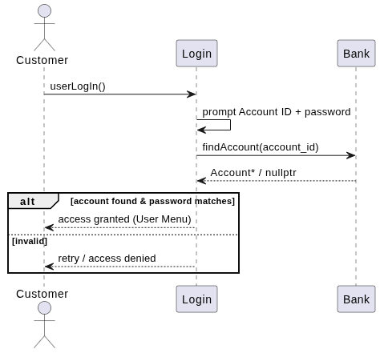
</p>

---

## 💼 Account Types

### 💰 Savings Account

| Attribute | Rule |
|---|---|
| **Interest Rate** | Configurable at account creation; represents the annual/periodic rate applied to the balance. |
| **Minimum Balance Rule** | Withdrawals that would drop the balance below the account's protected floor are rejected. |
| **Withdrawal Rules** | Strict — no negative balance is ever permitted under any circumstance. |

### 💳 Checking Account

| Attribute | Rule |
|---|---|
| **Overdraft** | The account may go negative, up to a configured limit, to accommodate short-term liquidity needs. |
| **Overdraft Limit** | Set per-account at creation time; defines the maximum negative balance allowed. |
| **Withdrawal Rules** | Flexible — withdrawals are permitted as long as the resulting balance does not exceed the overdraft limit in the negative direction. |

---

## 🔄 Banking Operations

| Operation | Internal Behavior |
|---|---|
| **Create Account** | Constructs a `SavingsAccount` or `CheckingAccount`, assigns the next available static Account ID, and registers it with `Bank`, which persists the updated account list immediately. |
| **Delete Account** | `Bank::findAccount()` locates the target by ID; if found, the object is deallocated, removed from the internal collection, and the account file is rewritten. |
| **Deposit** | Locates the account, increases its balance, generates a `Transaction` of type `Deposit`, and persists both the account and transaction files. |
| **Withdraw** | Locates the account, validates the withdrawal against the account's specific business rule (minimum balance or overdraft limit), applies the change, logs a `Transaction` of type `Withdraw`, and persists state. |
| **Transfer** | Locates both sender and receiver accounts, rejects self-transfers, withdraws from the sender, deposits to the receiver, and records a single `Transaction` of type `Transfer` capturing both parties. |
| **Display Account(s)** | Iterates the account collection and invokes each account's polymorphic `displayAccountInfo()`. |
| **Display Transactions** | Iterates the full transaction ledger (or a filtered subset for a specific account) and prints each entry via `displayTransaction()`. |
| **Display Statistics** | Aggregates the ledger into totals per transaction type (deposits, withdrawals, transfers) and reports the grand total. |

#### Create Account Sequence

<p align="center">
    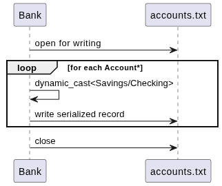
</p>

### Use Case Diagram

The following diagram summarizes all operations available to administrators and users.

<p align="center">
    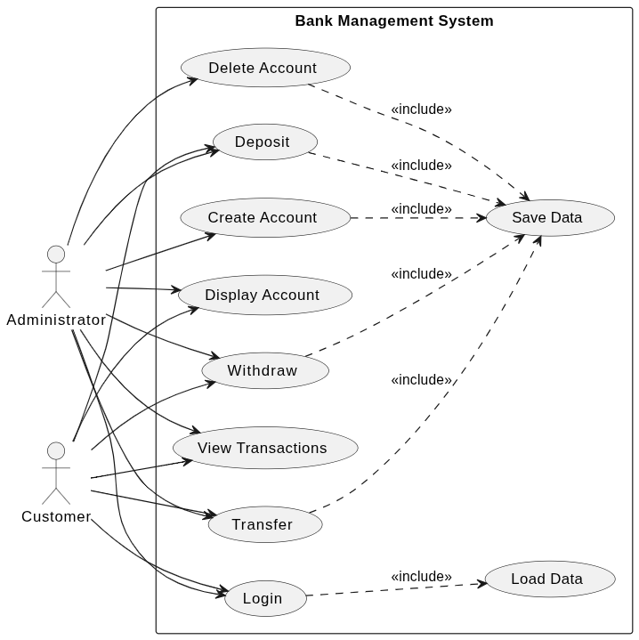
</p>

Every write operation in the table above follows the same pattern: **validate → mutate in-memory state → log a transaction → persist to disk**, ensuring the in-memory model and the on-disk record never drift apart.

---

## 🧾 Transaction System

Every banking operation that changes money — a deposit, a withdrawal, or a transfer — automatically and unconditionally produces a corresponding `Transaction` object. There is no code path that mutates a balance without generating an audit record.

Each `Transaction` stores:

| Field | Description |
|---|---|
| **Transaction ID** | Unique, monotonically increasing identifier assigned via a static counter. |
| **Type** | One of `Deposit`, `Withdraw`, or `Transfer`, modeled as a strongly typed `enum class`. |
| **Amount** | The monetary value involved in the operation. |
| **Date** | The calendar date the transaction was recorded. |
| **Time** | The clock time the transaction was recorded. |
| **Sender Account ID** | The originating account for withdrawals and transfers (`0` for deposits, which have no sender). |
| **Receiver Account ID** | The destination account for deposits and transfers (`0` for withdrawals, which have no receiver). |

The complete set of transactions forms an append-only **ledger**, queryable either in full (`displayTransactions`) or scoped to a single account (`displayBankAccountTransaction`), giving both administrators and customers a complete, chronological audit trail.

---

## 💾 Persistent Storage

The system implements its own lightweight persistence layer using flat text files, eliminating the need for an external database engine while still guaranteeing durability across application restarts.

| Data | File | Written By | Read By |
|---|---|---|---|
| Accounts | `data/accounts.txt` | `Bank::saveAccount()` | `Bank::loadAccounts()` |
| Transactions | `data/transactions.txt` | `Bank::saveTransactions()` | `Bank::loadTransactions()` |

### Account File Format (`accounts.txt`)

```text
AccountID,OwnerName,Password,AccountType,Balance,ExtraField
```

| Field | Meaning for `Savings` | Meaning for `Checking` |
|---|---|---|
| `ExtraField` | Interest Rate | Overdraft Limit |

**Example row:**

```text
1,John Smith,secretpass,Savings,5000.00,2.5
```

### Transaction File Format (`transactions.txt`)

```text
TransactionID,Type,Amount,Date,Time,SenderAccountID,ReceiverAccountID
```

**Example row:**

```text
1,Deposit,500.00,2026-07-30,14:22:05,0,1
```
#### Load Accounts Sequence

<p align="center">
    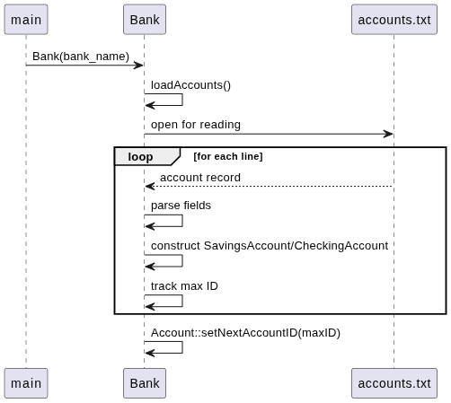
</p>

### ID Continuity Across Restarts

Both `Account` and `Transaction` use **static ID counters** internal to their respective classes. On startup, `Bank::loadAccounts()` and `Bank::loadTransactions()` scan every persisted record, track the **highest ID encountered**, and call `Account::setNextAccountID()` / `Transaction::setNextTransactionID()` to seed the counter one step past it. This guarantees that newly created accounts and transactions always receive fresh, non-colliding identifiers — even after the application has been closed and reopened many times.

---

## 🚨 Exception Handling

All validation in the system is exception-driven rather than relying on silent failure codes or boolean returns, ensuring that every failure is explicit, typed, and carries a human-readable message.

| Validation | Exception Type | Trigger Condition |
|---|---|---|
| Null account pointer | `std::invalid_argument` | Attempting to register a `nullptr` account. |
| Duplicate account | `std::invalid_argument` | Attempting to add an account whose ID already exists in the bank. |
| Account not found | `std::invalid_argument` | Deposit, withdraw, transfer, or lookup targets a non-existent Account ID. |
| Self-transfer | `std::invalid_argument` | Sender and receiver accounts in a transfer resolve to the same account. |
| Sender not found | `std::invalid_argument` | Transfer references a sender ID that does not exist. |
| Receiver not found | `std::invalid_argument` | Transfer references a receiver ID that does not exist. |
| Insufficient funds / overdraft exceeded | `std::invalid_argument` | Withdrawal would violate the account's minimum-balance or overdraft rule. |
| Invalid login credentials | `std::invalid_argument` | Supplied password does not match the stored password for the target account. |
| File opening failure (accounts) | `std::runtime_error` | `data/accounts.txt` cannot be opened for writing during a save. |
| File opening failure (transactions) | `std::runtime_error` | `data/transactions.txt` cannot be opened for writing during a save. |
| Malformed console input | Handled at the menu layer via stream state checks | Non-numeric input supplied where a number is expected; buffer is cleared and the user is re-prompted. |

Every menu-level operation wraps its call into `Bank` in a `try/catch` block, ensuring that a thrown exception is caught, its message is displayed to the user, and the application returns cleanly to the menu rather than terminating unexpectedly.

---

## ⚙️ Modern C++ Features

| Feature | Where It's Used |
|---|---|
| **Constructor Initialization Lists** | `Bank::Bank(const std::string &bank_name) : bank_name_(bank_name)` and similar patterns across account constructors. |
| **`enum class`** | `Transaction::TransactionType` (`Deposit`, `Withdraw`, `Transfer`) — strongly typed, scoped, and collision-free. |
| **`std::vector`** | Used for both the account collection (`std::vector<Account*>`) and the transaction ledger (`std::vector<Transaction>`). |
| **`std::string`** | Used throughout for names, passwords, dates, and times. |
| **Dynamic Casting (`dynamic_cast`)** | Used in `Bank::saveAccount()` to determine the concrete runtime type of each `Account*` before serializing type-specific fields. |
| **Virtual Functions & `override`** | Core to the polymorphic `Account` hierarchy, enabling `SavingsAccount` and `CheckingAccount` to specialize shared behavior. |
| **Runtime Polymorphism** | `Bank` operates on `Account*` uniformly, regardless of concrete subclass. |
| **Exceptions (`<stdexcept>`)** | `std::invalid_argument` and `std::runtime_error` form the backbone of the validation strategy. |
| **File Streams (`<fstream>`, `<sstream>`)** | Power the entire persistence layer — reading, writing, and parsing delimited records. |
| **RAII-Managed Resources** | File streams and container-managed memory are released deterministically at scope exit. |
| **Range-Based `for` Loops** | Used extensively for iterating accounts and transactions cleanly and safely. |

---

## 🧠 Design Decisions

| Decision | Rationale |
|---|---|
| **Abstract `Account` base class** | Establishes a single contract that every account type must honor, enabling `Bank` to remain agnostic to concrete account types. |
| **Dynamic polymorphism over static/templated design** | Account types are determined at runtime (from user input and from persisted files), which is a natural fit for virtual dispatch rather than compile-time generics. |
| **Separate `SavingsAccount` / `CheckingAccount` classes** | Interest accrual and overdraft handling are fundamentally different business rules; separating them avoids conditional branching inside a single monolithic account class. |
| **Static Account IDs** | Guarantees uniqueness across the process lifetime without requiring a database sequence, and trivially resumes correctly after reloading persisted data. |
| **Static Transaction IDs** | Mirrors the account ID strategy, keeping the ledger's identifiers globally unique and chronologically meaningful. |
| **Persistent storage via text files** | Provides real durability without introducing an external dependency, keeping the project self-contained and easy to build/run anywhere. |
| **Text files instead of a database** | Appropriate for the project's scope — human-readable, dependency-free, and sufficient to demonstrate correct persistence semantics; a natural upgrade path to SQLite is documented below. |
| **Virtual destructor in `Account`** | Ensures that deleting a derived object (`SavingsAccount`/`CheckingAccount`) through a base `Account*` correctly invokes the derived destructor, preventing resource leaks. |
| **Exception-based validation** | Centralizes failure handling, keeps business logic free of error-code plumbing, and produces clear, actionable messages for the console UI. |

---

## 🔁 Sample Workflow

```text
Application Start
       │
       ▼
   Load Files            (Bank constructor → loadAccounts() / loadTransactions())
       │
       ▼
      Login               (credential prompt, bounded retries)
       │
       ▼
  Authentication           (validate Account ID + password / admin credentials)
       │
       ▼
   Admin / User            (role-specific menu is presented)
       │
       ▼
 Perform Operation         (e.g., deposit, withdraw, transfer, remove account)
       │
       ▼
  Update Objects           (in-memory Account / Bank state is mutated)
       │
       ▼
 Create Transaction        (an immutable Transaction record is generated)
       │
       ▼
    Save Files             (accounts.txt and transactions.txt are rewritten)
```

This cycle repeats for every operation performed in a session, guaranteeing that the on-disk state is never more than one operation behind the in-memory state.

---

## 🗺️ Possible Improvements

| Improvement | Value It Would Add |
|---|---|
| 🗄️ **SQLite Integration** | Replace flat-file persistence with a real embedded database — transactions, indexing, and concurrent access. |
| 🔒 **Password Hashing** | Replace plain-text password storage with a salted hash (e.g., bcrypt/argon2) for genuine credential security. |
| 🧠 **Smart Pointers** | Migrate `Account*` raw pointers to `std::unique_ptr<Account>` to eliminate manual `delete` calls entirely. |
| ✅ **Unit Testing** | Introduce a framework (GoogleTest/Catch2) to cover `Bank`, `Account`, and `Transaction` logic with automated regression tests. |
| 🖼️ **Qt GUI** | Provide a graphical front-end as an alternative to the console interface. |
| 🌐 **REST API Layer** | Expose banking operations over HTTP for integration with external clients or a web front-end. |
| 🧵 **Multithreading** | Support concurrent sessions safely with proper synchronization around shared `Bank` state. |
| 📝 **Logging Framework** | Structured, leveled logging (info/warning/error) for operational visibility beyond console output. |
| 📤 **CSV Export** | Allow transaction history and account summaries to be exported for use in spreadsheets. |
| 📆 **Monthly Reports** | Automated statement generation summarizing activity over a given period. |
| 📈 **Interest Scheduler** | Automated periodic interest accrual for `SavingsAccount` instances based on elapsed time. |

---

## 🔧 Build Instructions

### Prerequisites

- A C++20-compliant compiler (GCC 10+, Clang 12+, or MSVC 19.28+)

### Compile

```bash
g++ -std=c++20 -Iinclude src/*.cpp src/*.cc -o BankSystem
```

### Run

```bash
./BankSystem
```

> 💡 On first run, the application will automatically create the `data/` directory contents as accounts and transactions are added — no manual setup is required.

---

## 🖼️ Screenshots

### Main Menu
*(Add Screenshot Here)*

### Admin Menu
*(Add Screenshot Here)*

### User Menu
*(Add Screenshot Here)*

---

## 📐 UML Diagrams

# 📐 UML Diagrams

The project documentation includes a complete UML model describing both the static architecture and dynamic behavior of the system.

| Diagram | Purpose |
|---------|---------|
| Package Diagram | Project organization |
| Class Diagram | Object-Oriented design |
| Deployment Diagram | Runtime architecture |
| Use Case Diagram | System functionality |
| User Login Sequence | Authentication workflow |
| Create Account Sequence | Account creation |
| Load Accounts Sequence | Loading persistent data |
| Deposit Sequence | Deposit workflow |
| Withdraw Sequence | Withdrawal workflow |
| Transfer Sequence | Transfer workflow |

All UML source files are located in:

```text
UML/
```

Rendered images are located in:

```text
UML/image/
```

Class diagrams and sequence diagrams describing the `Account` hierarchy, the `Bank`–`Transaction` relationship, and the authentication flow live under the  directory.

# 📷 UML Gallery

| Diagram | Preview |
|----------|---------|
| Package |  |
| Class |  |
| Use Case |  |
| Login |  |
| Startup | 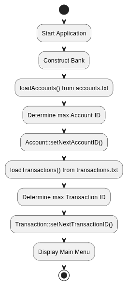 |
| Save |  |
| Load |  |
| Deposit | 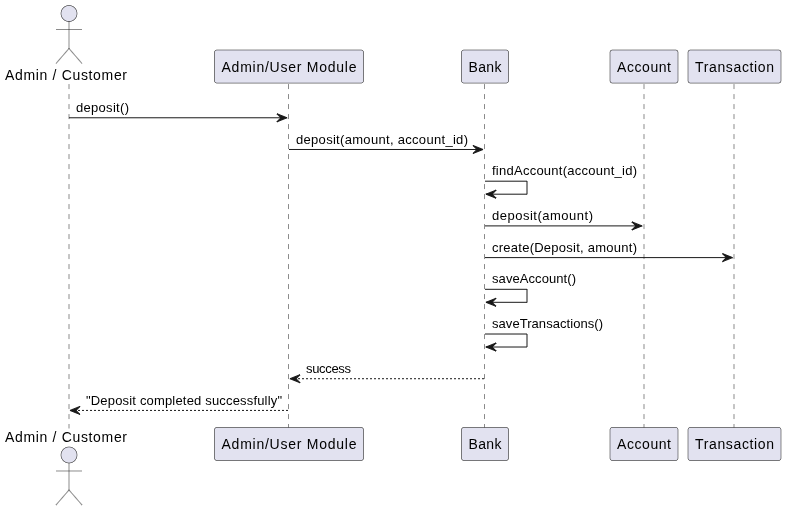 |
| Withdraw | 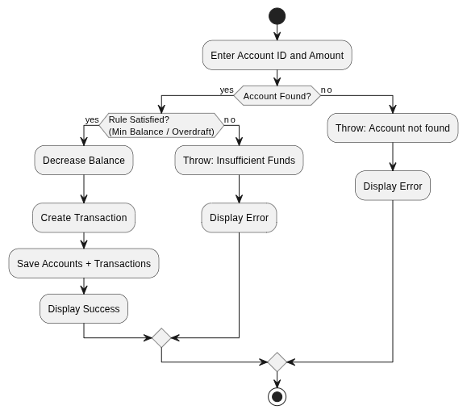 |
| Transfer | 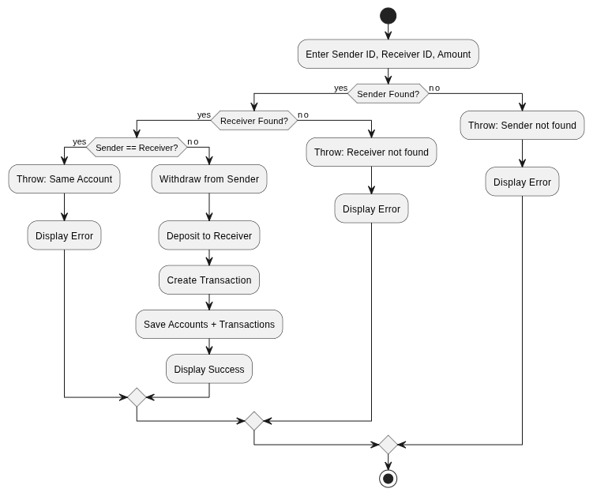 |

---

## 👩‍💻 Author

<div align="center">

### **Sara Saad Mahmoud**

Electronics and Communication Engineering Student · Al-Azhar University

Interests: **Embedded Systems** · **Modern C++** · **Software Engineering** · **Robotics**

[](https://github.com/SaraSaadMohamud?tab=repositories)
[](https://www.linkedin.com/in/sara-saad-b7565a2b9/)
[](sarasaadmahmoud146@gmail.com)

</div>

---

*Built with ❤️ and modern C++ by Sara Saad Mahmoud*

</div>