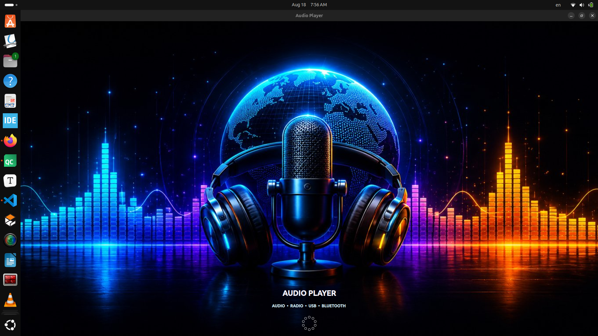
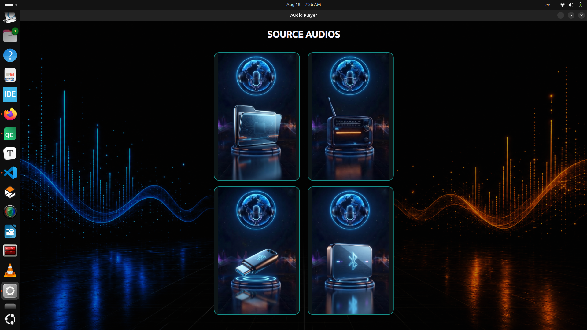
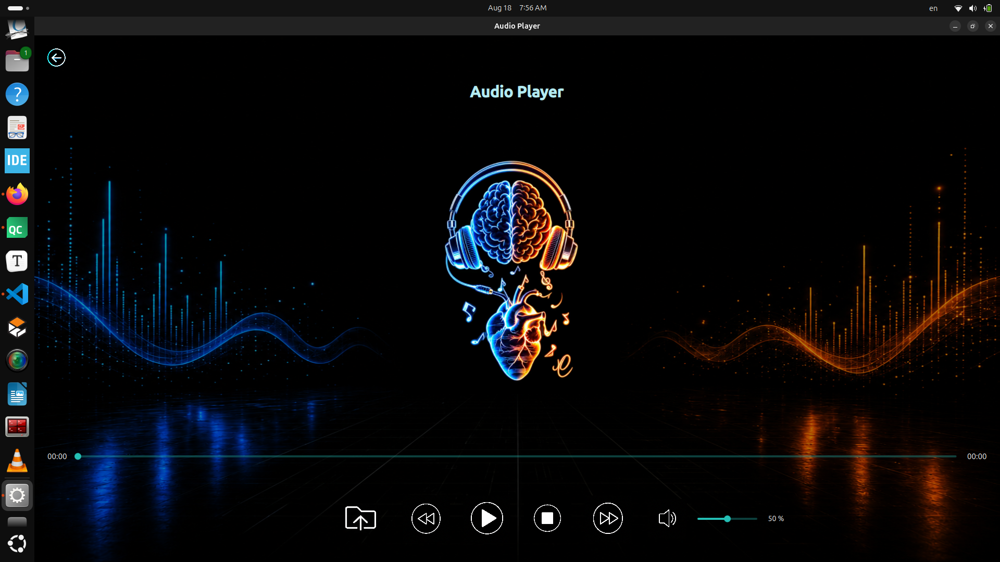
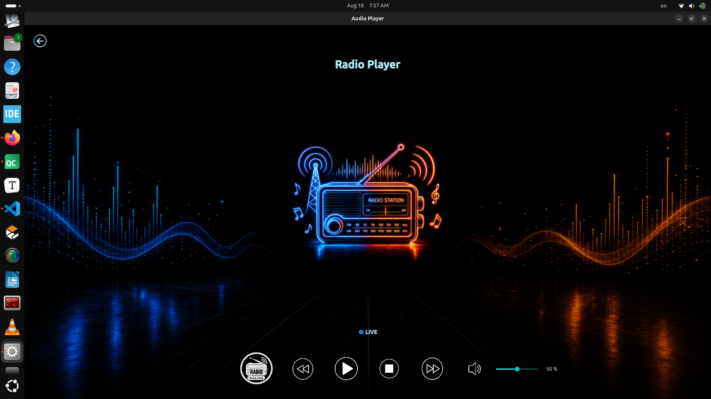
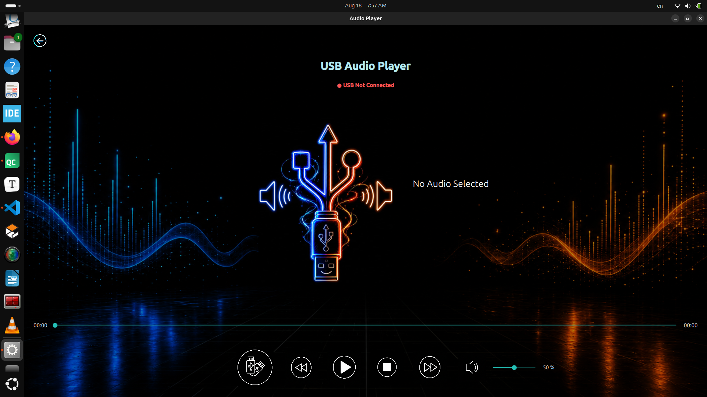

# 🎵 Audio Player

A desktop **Audio Player** built with **Qt Quick (QML)** and **C++**, designed around a touch-friendly, embedded-style interface (fixed 800×480 window, dark Material theme, virtual keyboard support). The app lets users play audio from their **local file system**, a **USB drive**, or a **paired Bluetooth device**, and stream **internet radio stations**, all through a single, consistent playback UI backed by a shared C++ media engine built on `QMediaPlayer` and `QAudioOutput`.

**Core capabilities:** local folder playback, USB device detection and playback, internet radio streaming with a user-editable station list, Bluetooth device scanning/pairing with automatic OBEX file receiving, live playback metadata (title/artist/genre/album), and volume/mute/seek controls — all exposed to QML through Qt's property/signal system.

---

## 📸 Screenshots

---

---

---

---

---

## ✨ Features

### 🎧 Shared Playback Engine
Both the local/USB player and the radio player are built around `QMediaPlayer` + `QAudioOutput`, exposing a consistent set of controls to QML:
- Play / Pause (toggle)
- Stop
- Volume control (0.0–1.0, clamped)
- Mute / unmute
- Playing-state notification
- Error reporting (`QMediaPlayer::errorOccurred` is caught, logged, and surfaced as an `error_string` property)

### 💾 Local Audio (`LocalAudioPage.qml` + `AudioPlayer`)
- Select a folder via a native `FolderDialog`
- Automatically scans the folder for `.mp3`, `.m4a`, and `.wav` files and builds a playlist
- Play / Pause / Stop / Next / Previous through the playlist
- Seek bar bound to live `position` / `duration`, with elapsed and remaining time (`formateTime()` formats `mm:ss` or `hh:mm:ss`)
- Live metadata display (title, author, genre, album) pulled from `QMediaMetaData` whenever the track changes

### 🔌 USB Audio (`USBPage.qml` + `AudioPlayer`)
- **Automatic USB detection**: a QML `Timer` polls `scanUSB()` every 300 ms, scanning `/media/<user>` for mounted volumes
- Supports **multiple simultaneously connected USB devices**, listed in a selection popup
- Recursively scans each device for `.mp3`, `.m4a`, and `.wav` files
- **Device selection popup** followed by a **file selection popup**, so the user picks a device, then a track to play
- Manual track selection via `playSelected(index)`
- **Disconnection handling**: when a device is removed, `clearUSB()` stops playback, clears the playlist/metadata, and closes any open popups
- USB connection state (`usb_connect`), current path (`usb_path`), and available devices (`usb_devices`) are all reactive QML properties

### 📻 Radio (`RadioPage.qml` + `RadioPlayer`)
- Ships with a **built-in list of 7 predefined stations** (Egypt, Saudi Arabia, Kuwait ×2, Morocco, Jordan, Tunisia), each with name, country, and stream URL
- Station picker popup listing all stations by name and country
- Play / Pause (toggle), Stop, Next / Previous station (cycles through the list)
- **Add a new station at runtime** through an in-app form (name, country, stream URL) via `addRadioStation()`
- Volume and mute controls, independent from the local/USB player
- Error handling via `errorOccurred`/`error_string`, logged through the app's logging category
- A "Remove station" action exists in the C++ backend (`removeRadioStation`) and matching UI code, but both are currently **commented out** and not active in the running app

### 🟦 Bluetooth Audio (`BluetoothPage.qml` + `BluetoothManager`)
- Bluetooth adapter power state is monitored live via `QBluetoothLocalDevice` and surfaced as `bluetoothPoweredOn`
- **Device scanning**: `startScan()` runs a combined Classic + Low Energy discovery (`QBluetoothDeviceDiscoveryAgent`) for a fixed **10-second** window, with a live progress bar, elapsed-seconds counter, and scan start time shown in the popup
- Discovered devices are **de-duplicated by address** and classified into a human-readable type (Computer, Phone, Network, Audio / Video, Peripheral, Imaging, Wearable, Toy, Miscellaneous, Unknown) based on `QBluetoothDeviceInfo::majorDeviceClass()`, and flagged `isAudioDevice` when the device is Audio/Video class
- **Pairing & connecting**: tapping a device in the popup calls `pairAndConnect(address, name)`, which drives the system's `bluetoothctl` (`power on`, `agent on`, `default-agent`, `pairable on`, `pair`, `trust`, `connect`) and then confirms success with a follow-up `bluetoothctl info <address>` check for `"Connected: yes"`
- **Disconnect**: a "Disconnect" button on the player screen tears the connection down via `bluetoothctl disconnect <address>`
- **OBEX file receiving**: once connected, an external `bt-obex -s <dir>` process is launched to listen for incoming file transfers into a dedicated `BluetoothReceived` folder under the system Music location (typically `~/Music/BluetoothReceived`); incoming transfer prompts (`Accept (yes/no)?`) are **auto-accepted**
- **Automatic audio hand-off**: when a transfer finishes (or the receive folder changes on disk), the most recently modified `.mp3` / `.m4a` / `.wav` file is checked twice, 200 ms apart, to confirm it has finished writing, then handed to the shared `AudioPlayer` — the page automatically switches from the "waiting to receive" screen to the full playback screen (artwork, metadata, seek bar, play/pause/stop, volume/mute)
- Errors are surfaced through `AudioPlayer`'s existing `errorOccured` signal, logged the same way as local/USB playback
- Bluetooth power-off, discovery errors, and connection failures are all reflected in a single human-readable `connectionStatus` string shown in the UI

### 📝 Metadata
Exposed for local, USB, and Bluetooth-received playback (all routed through `AudioPlayer`, using `QMediaMetaData`):
- **Title**
- **Author / Artist** (`ContributingArtist`)
- **Genre**
- **Album**

Radio streams expose the current station **name** only (`current_radio_station`); no track-level metadata is read from radio streams.

---

## 🛠️ Technologies Used

| Technology | Purpose |
|---|---|
| C++17 | Backend logic, audio engine, USB scanning, Bluetooth management |
| Qt 6 (Core, GUI) | Application framework |
| Qt Quick / QML | Declarative user interface |
| Qt Quick Controls (Material style) | UI widgets, dark Material theme with a teal accent |
| Qt Quick Dialogs | Native folder picker (`FolderDialog`) for local audio |
| Qt Multimedia (`QMediaPlayer`, `QAudioOutput`, `QMediaMetaData`) | Audio playback, volume/mute, metadata extraction |
| Qt Bluetooth (`QBluetoothDeviceDiscoveryAgent`, `QBluetoothLocalDevice`, `QBluetoothDeviceInfo`) | Bluetooth adapter state and device discovery |
| `QProcess` | Shelling out to `bluetoothctl` (pairing/connecting) and `bt-obex` (OBEX file receiving) |
| `QFileSystemWatcher` | Watching the Bluetooth receive directory for newly written files |
| `QStandardPaths` | Resolving the platform's Music location for the Bluetooth receive folder |
| Qt Virtual Keyboard | On-screen keyboard input (enabled via `QT_IM_MODULE`), suited for touchscreen/embedded use |
| QML type registration (`QML_ELEMENT`) | Exposes `AudioPlayer`, `RadioPlayer`, and `BluetoothManager` C++ classes directly as QML components |
| Qt Logging Categories | Custom `app.mediaPlayer` category for structured debug/info/warning logs |

---

## 🏗️ Architecture

```text
QML UI (Main.qml → StackView)
   │
   ├── SplashPage.qml        (2s intro screen)
   ├── SourcePage.qml        (source selection: Local / USB / Radio / Bluetooth)
   ├── LocalAudioPage.qml    ──┐
   ├── USBPage.qml           ──┼── use AudioPlayer (C++)
   ├── BluetoothPage.qml     ──┤   (also uses BluetoothManager for scan/pair/receive)
   └── RadioPage.qml         ──── uses RadioPlayer (C++)
                                     │
                                     ▼
                          C++ Backend (QObject-derived, QML_ELEMENT)
                                     │
                    ┌────────────────┼──────────────────┬────────────────────────┐
                    ▼                ▼                   ▼                        ▼
             QMediaPlayer      QAudioOutput      Local FS / /media/<user>   BluetoothManager
           (playback engine)  (volume & mute)     (folder scan, USB scan)   (device discovery,
                                                                              bluetoothctl pairing,
                                                                              bt-obex file receiving)
```

Each page instantiates its own backend object (`AudioPlayer`, `RadioPlayer`, and/or `BluetoothManager`) directly in QML. State (position, duration, playlist, metadata, USB devices, radio stations, Bluetooth devices/connection) is exposed as `Q_PROPERTY` values with `NOTIFY` signals, so the UI updates reactively without manual polling — except for USB *presence detection* (polled every 300 ms, since there is no OS-level hot-plug signal wired in) and Bluetooth *scan progress* (driven by a 1-second `QTimer` alongside the asynchronous discovery agent).

### Source files

| File | Role |
|---|---|
| `main.cpp` | App entry point; loads the `Main` QML component from the `FinalProject_AdioPlayer` module; enables the Qt Virtual Keyboard input method |
| `Main.qml` | Application window (800×480, Material Dark theme) hosting a `StackView` |
| `SplashPage.qml` | Animated intro screen, auto-advances to `SourcePage` after 2 seconds |
| `SourcePage.qml` | Grid of source cards (Local, Radio, USB, Bluetooth) with hover effects |
| `LocalAudioPage.qml` | UI for local folder playback |
| `USBPage.qml` | UI for USB device/file selection and playback |
| `RadioPage.qml` | UI for radio station browsing, playback, and adding stations |
| `BluetoothPage.qml` | UI for Bluetooth scanning, pairing, OBEX-receive status, and playback of the received audio file |
| `audioplayer.h` / `.cpp` | `AudioPlayer` class: local & USB playback, playlist, metadata, USB scanning |
| `radioplayer.h` / `.cpp` | `RadioPlayer` class: radio station list, streaming playback |
| `bluetoothmanager.h` / `.cpp` | `BluetoothManager` class: Bluetooth adapter state, device discovery, pairing/connection via `bluetoothctl`, OBEX file receiving via `bt-obex`, automatic detection of completed audio transfers |
| `loggin.h` / `.cpp` | Declares the `app.mediaPlayer` Qt logging category used across the backend |

---

## 🧭 Application Flow

```
Main.qml (ApplicationWindow, 800×480, Material.Dark, accent #24BFB5)
   └── StackView
          │  initialItem
          ▼
      SplashPage.qml ──(2s Timer → splashFinished signal)──► SourcePage.qml
                                                                    │ push()
                                        ┌───────────────┬──────────┼──────────────┐
                                        ▼               ▼          ▼              ▼
                              LocalAudioPage.qml   RadioPage.qml  USBPage.qml  BluetoothPage.qml
```

Navigation is handled entirely by `StackView.push()` / `root.StackView.view.pop()` — there is no routing layer or view-model; each page owns its own backend instance(s) and pops itself via the back-arrow image button (`images/return.png`) in the top-left corner. `BluetoothPage.qml` additionally stops any in-progress scan and stops playback before popping.

---

## 🧩 `AudioPlayer` — Full API Reference

Registered to QML via `QML_ELEMENT` (module `FinalProject_AdioPlayer`). Wraps one `QMediaPlayer` + one `QAudioOutput`, shared by `LocalAudioPage.qml`, `USBPage.qml`, and `BluetoothPage.qml` (each page creates its **own separate instance**, so local, USB, and Bluetooth playback state are fully independent).

**Properties**

| Property | Type | Access | Backing |
|---|---|---|---|
| `playing_state` | `bool` | read-only | `QMediaPlayer::isPlaying()` |
| `position` | `qint64` | read/write | `QMediaPlayer::position()`, bounds-checked against `duration` in the setter |
| `duration` | `qint64` | read-only | `QMediaPlayer::duration()` |
| `muted` | `bool` | read/write | `QAudioOutput::isMuted()` |
| `volume` | `float` | read/write | `QAudioOutput::volume()`, clamped to `[0.0, 1.0]` via `qBound` |
| `playing_list` | `QStringList` | read-only | Absolute file paths of the current playlist |
| `current_playlist_index` | `qint64` | read-only | Index of the active track in `playing_list` |
| `audio_title` / `audio_author` / `audio_genre` / `audio_album` | `QString` | read-only | Populated from `QMediaMetaData` on `metaDataChanged` |
| `error_string` | `QString` | read-only | Last error message from `QMediaPlayer` |
| `usb_connect` | `bool` | read-only | Whether any USB audio device is currently mounted |
| `usb_path` | `QString` | read-only | Path of the currently loaded USB device |
| `usb_devices` | `QStringList` | read-only | Paths of all detected USB devices containing audio files |

**Invokable methods**

| Method | Behavior |
|---|---|
| `playPause()` | Toggles between `play()` and `pause()` based on current state |
| `stop()` | Stops playback |
| `next()` / `previouse()` *(sic)* | Advances/rewinds through `playing_list` with wraparound (`% size`); emits an error if the list is empty |
| `loadFolder(folder_path)` | Converts a `file://` URL to a local path, filters the directory for `*.mp3`, `*.m4a`, `*.wav`, builds the playlist, and starts loading the first file |
| `formateTime(time_ms)` *(sic)* | Formats milliseconds as `mm:ss`, or `h:mm:ss` once the duration passes one hour |
| `scanUSB()` | Scans `/media/<user>` for mounted volumes, recursively checks each for audio files, and updates `usb_connect` / `usb_devices` |
| `loadUSB(usbPath)` | Recursively indexes a specific USB path into `playing_list`; resets metadata and playback position but does **not** auto-play |
| `playSelected(index)` | Loads (but does not force-play) the track at `index` in the playlist |
| `clearUSB()` | Stops playback and resets playlist, metadata, and USB state — called on device removal |

**Signals**: `playingStateChanged`, `positionChanged`, `durationChanged`, `muteStateChanged`, `volumeChanged`, `playListChanged`, `currentPlayListIndexChanged`, `metaDataChanged`, `errorOccured` *(sic)*, `usbConnectionChanged`, `usbPathChanged`, `usbDevicesChanged`.

> **Note:** `BluetoothPage.qml` invokes `audioPlayer.playBluetoothFile(filePath)` on its own `AudioPlayer` instance to load and play a received Bluetooth audio file. This method is used by the QML but was not present in the `audioplayer.h` / `.cpp` source reviewed for this README, so its exact implementation is not documented here — see [Known Issues](#-known-issues--inconsistencies) below.

---

## 📻 `RadioPlayer` — Full API Reference

Also registered via `QML_ELEMENT`, instantiated once per `RadioPage.qml`. Wraps its own `QMediaPlayer` + `QAudioOutput`, entirely independent of `AudioPlayer`.

**Properties**

| Property | Type | Access | Backing |
|---|---|---|---|
| `playing_state` | `bool` | read-only | `QMediaPlayer::isPlaying()` |
| `muted` | `bool` | read/write | `QAudioOutput::isMuted()` |
| `volume` | `float` | read/write | Clamped to `[0.0, 1.0]` |
| `radio_station` | `QVariantList` | read-only | List of `{name, country, url}` maps |
| `current_radio_station` | `QString` | read-only | Name of the currently tuned station |
| `current_radio_station_index` | `qint64` | read-only | Index into `radio_station` |
| `error_string` | `QString` | read-only | Last playback error message |

**Invokable methods**

| Method | Behavior |
|---|---|
| `playRadioStation(index)` | Validates the index, sets the stream URL as the media source, and starts playback |
| `toggleRadioPlayback()` | Toggles play/pause on the current stream |
| `stopRadioStation()` | Stops playback |
| `nextRadioStation()` / `previousRadioStation()` | Cycles through the station list with wraparound |
| `addRadioStation(name, country, url)` | Appends a new station to the in-memory list after trimming/validating the three fields are non-empty |
| `removeRadioStation(url)` *(commented out)* | Fully written in the source (finds by URL, safely re-indexes if the removed station was playing) but disabled in both the header and implementation |

**Signals**: `radioPlayingStateChanged`, `radioMuteStateChanged`, `radioVolumeChanged`, `radioStationsChanged`, `currentRadioStationChanged`, `currentRadioStationIndexChanged`, `radioErrorOccured` *(sic)*.

### Built-in stations (hard-coded in `radioplayer.cpp`)

| Name | Country | Stream URL |
|---|---|---|
| Cairo Radio Station | 🇪🇬 Egypt | `http://n12.radiojar.com/8s5u5tpdtwzuv` |
| Maka Radio Station | 🇸🇦 Saudi Arabia | `https://edge.mixlr.com/channel/rwumx` |
| Kuwait Radio Station | 🇰🇼 Kuwait | `https://radio.mp3islam.com/listen/quran_radio/radio.mp3` |
| Morocco Radio Station | 🇲🇦 Morocco | `http://stream.radiojar.com/0tpy1h0kxtzuv` |
| Jordan Quran Radio | 🇯🇴 Jordan | `https://jrtv-live.ercdn.net/jrradio/quranradio.m3u8` |
| Kuwait Radio Station | 🇰🇼 Kuwait | `https://radio.mp3islam.com/listen/abdulbasit/radio.mp3` |
| Zitouna Quran Radio | 🇹🇳 Tunisia | `https://radio.radiotunisienne.tn/radiozaitouna` |

Stations added at runtime via `addRadioStation()` live only in memory for the current session — there is no persistence layer (no file/database writeback), so the list resets to these seven on every app restart.

---

## 🟦 `BluetoothManager` — Full API Reference

Registered to QML via `QML_ELEMENT` (module `FinalProject_AdioPlayer`), instantiated once per `BluetoothPage.qml`. Wraps `QBluetoothDeviceDiscoveryAgent` and `QBluetoothLocalDevice` for discovery/adapter state, and manages two external processes (`bluetoothctl` for pairing/connecting, `bt-obex` for OBEX file receiving) via `QProcess`.

**Properties**

| Property | Type | Access | Backing |
|---|---|---|---|
| `scanning` | `bool` | read-only | Whether a discovery scan is currently in progress |
| `bluetoothPoweredOn` | `bool` | read-only | `QBluetoothLocalDevice::hostMode() != HostPoweredOff` |
| `devices` | `QVariantList` | read-only | Discovered devices, each a map of `{name, address, rssi, type, isAudioDevice}` |
| `scanProgress` | `int` | read-only | 0–100, based on elapsed seconds vs. the fixed 10-second scan window |
| `scanElapsedSeconds` | `int` | read-only | Seconds elapsed since the current scan started |
| `scanStartTime` | `QString` | read-only | Scan start time formatted as `hh:mm:ss` |
| `scanCompleted` | `bool` | read-only | Set once the fixed scan window has elapsed |
| `connected` | `bool` | read-only | Whether a device is currently connected |
| `connectedDeviceName` | `QString` | read-only | Name of the currently connected device |
| `connectionStatus` | `QString` | read-only | Human-readable status string shown throughout the UI |
| `receivingFile` | `bool` | read-only | Whether the OBEX receiver is active / a transfer is in progress |
| `receivedFilePath` | `QString` | read-only | Absolute path of the most recently confirmed received audio file |

**Invokable methods**

| Method | Behavior |
|---|---|
| `startScan()` | Clears the device list, resets scan progress/elapsed/completed state, starts a 1-second `QTimer` for progress updates, and starts `QBluetoothDeviceDiscoveryAgent` discovery using `ClassicMethod \| LowEnergyMethod`. No-ops if Bluetooth is off or a scan is already running |
| `stopScan()` | Stops the progress timer and the discovery agent (or calls `discoveryFinished()` directly if the agent isn't active) |
| `pairAndConnect(address, name)` | Runs `bluetoothctl --timeout 30`, writing a script (`power on`, `agent on`, `default-agent`, `pairable on`, `pair <addr>`, `trust <addr>`, `connect <addr>`, `quit`) to its stdin; on completion, runs `bluetoothctl info <address>` and checks the output for `"Connected: yes"` to determine success. On success, updates `connected`/`connectedDeviceName` and calls `startFileReceiver()` |
| `disconnectDevice()` | Runs `bluetoothctl disconnect <address>` synchronously, stops the file receiver, and resets connection state |
| `setDiscoverable(enabled)` | Toggles `discoverable`/`pairable` mode via synchronous `bluetoothctl` calls |
| `startFileReceiver()` | Resolves the receive directory (`QStandardPaths::MusicLocation` + `/BluetoothReceived`, falling back to `~/Music/BluetoothReceived`), creates it if missing, watches it with `QFileSystemWatcher`, and launches `bt-obex -s <dir>` as a child process |
| `stopFileReceiver()` | Gracefully terminates (then force-kills if needed) the `bt-obex` process |

**Signals**: `scanningChanged`, `bluetoothPoweredOnChanged`, `devicesChanged`, `scanProgressChanged`, `scanElapsedSecondsChanged`, `scanStartTimeChanged`, `scanCompletedChanged`, `connectedChanged`, `connectedDeviceChanged`, `connectionStatusChanged`, `receivingFileChanged`, `receivedFileChanged`, `fileReceived(const QString &filePath)`.

**Internal helpers** (not exposed to QML): `checkForReceivedAudioFile()` scans the receive directory for the newest `.mp3`/`.m4a`/`.wav` file, confirms its size is stable across a 200 ms window, and emits `fileReceived()` once; `handleObexOutput()` parses `bt-obex` stdout/stderr for transfer-request/name/size markers and auto-accepts `Accept (yes/no)?` prompts; `isAudioFile()` checks file extensions.

---

## 🔄 USB Detection Flow (step by step)

1. `USBPage.qml` starts a repeating `Timer` (`interval: 300`) on load.
2. Each tick calls `AudioPlayer::scanUSB()`, which:
   - Builds the path `/media/<$USER>` and checks it exists.
   - Lists subdirectories (each representing one mounted volume).
   - For each subdirectory, runs a recursive `QDirIterator` looking for `*.mp3`, `*.m4a`, `*.wav`; if at least one match is found, the device path is added to `usb_devices`.
   - Only emits `usbDevicesChanged` / `usbConnectionChanged` when the *set* of devices actually changed, avoiding redundant QML property updates every 300 ms.
3. If a device disappears while connected, `scanUSB()` calls `clearUSB()` internally; the QML `Timer.onTriggered` handler also independently detects the `usb_connect` transition and calls `stop()`, `clearUSB()`, and closes both popups — meaning cleanup is effectively triggered from two places (backend + QML) for redundancy.
4. Selecting a device in the popup calls `loadUSB(path)`, which indexes files but does **not** auto-play; `Qt.callLater` is used to wait a tick before opening the file-selection popup, checking `playing_list.length` first.
5. Selecting a file calls `playSelected(index)`, which sets the media source but — per the code — playback is only started implicitly (the explicit `m_media_player->play()` call is commented out in `playSelected`), so the user needs `playPause()` (the transport control) to actually start audio.

---

## 🔵 Bluetooth Pairing & File-Receiving Flow (step by step)

1. From `SourcePage.qml`, the Bluetooth card pushes `BluetoothPage.qml`, which instantiates its own `BluetoothManager` and `AudioPlayer`.
2. The page opens on a "receiving" screen showing live adapter power state (`bluetoothPoweredOn`), a connection status line, and a Bluetooth icon button that opens the device popup.
3. In the popup, tapping **Scan Devices** calls `startScan()`: the device list is cleared, scan progress/elapsed/start-time are reset, a 1-second progress `QTimer` starts, and `QBluetoothDeviceDiscoveryAgent` begins Classic + Low Energy discovery.
4. As `deviceDiscovered()` fires, each new device (de-duplicated by address) is classified by type and appended to `devices`; the popup's `ListView` updates live, showing name, type, address, and RSSI.
5. The progress `QTimer` updates `scanProgress` / `scanElapsedSeconds` every second; once 10 seconds have elapsed, the scan is marked complete and the discovery agent is stopped, which triggers `discoveryFinished()` and sets `connectionStatus` to a device-count summary.
6. Tapping a device in the list disconnects any currently connected device first, then calls `pairAndConnect(address, name)`, which scripts `bluetoothctl` to power on, enable the agent, pair, trust, and connect to the device, then verifies the result with `bluetoothctl info`.
7. On a confirmed connection, `connected` / `connectedDeviceName` update, the popup closes, and `startFileReceiver()` launches `bt-obex -s <BluetoothReceived dir>` to begin listening for incoming OBEX transfers.
8. `bt-obex` output is parsed by `handleObexOutput()`: transfer-request, file name, and file size are logged; `Accept (yes/no)?` prompts are answered automatically with `yes`; `connectionStatus` is updated through `"Receiving file..."` and finally `"File received"`.
9. Once a transfer succeeds (or the watched directory otherwise changes on disk, after a 700 ms debounce), `checkForReceivedAudioFile()` finds the newest `.mp3`/`.m4a`/`.wav` file, confirms its size is unchanged across a 200 ms check, and emits `fileReceived(filePath)` (only once per file).
10. `BluetoothPage.qml`'s `Connections` handler for `onFileReceived` stores the path, closes the popup if still open, flips `audioReceived` to `true` (revealing the playback screen), and calls `audioPlayer.playBluetoothFile(filePath)` to load and play the file through the shared `AudioPlayer` engine — title/author/genre/album, seek position/duration, and volume/mute all work exactly as they do on the Local Audio page.
11. Tapping **Disconnect** stops `audioPlayer`, calls `bluetoothManager.disconnectDevice()` (which also stops the OBEX receiver), and resets `audioReceived` / `receivedAudioPath`, returning the page to the "waiting to receive" screen.
12. If the adapter is powered off at any point, `hostModeStateChanged()` stops any active scan, stops the OBEX receiver, and clears the current connection automatically.

---

##  UI / Design Notes

- **Theme**: `Material.Dark` with a teal accent (`#24BFB5`); popups use a near-black background (`#15191B`) with a `#24BFB5` border.
- **Fixed window size**: 800×480 — sized for an embedded/in-vehicle touchscreen rather than a resizable desktop window.
- **Responsive sizing within pages**: icon/button sizes on the player pages scale off `Math.min(width, height)` (e.g. `icons_size = screenSize * 0.45`), so the layout adapts if the window is resized despite the app defaulting to a fixed size.
- **`SourcePage.qml`** renders the four sources as a 2×2 grid of image cards with hover scale (`1.025`) and border-highlight animations, each pushing a different page.
- **`SplashPage.qml`** fades/scales its content in (`OutCubic`/`OutBack` easing) and shows a `BusyIndicator` while a 2-second `Timer` runs before emitting `splashFinished()`.
- **Popups** (`RadioPage.qml`, `USBPage.qml`, `BluetoothPage.qml`) are custom-styled `Popup` items with their own `ListView` + `ScrollBar`, not the default OS dialogs.
- **`BluetoothPage.qml`** toggles between two full-screen states inside the same page — a "waiting to receive" screen (status, icon, connect button) and a playback screen (art, metadata, seek bar, transport controls, volume, Disconnect) — driven by the `audioReceived` boolean rather than a separate `StackView` push.

---

##  Known Issues / Inconsistencies

- **Property name mismatch on the USB page**: `USBPage.qml` reads `media_player.current_playing_index` in several bindings (track title fallback, author/genre/album visibility, elapsed/remaining time), but `AudioPlayer` only exposes `current_playlist_index`. Since QML silently returns `undefined` for a non-existent property, these specific bindings do not behave as intended (they won't correctly detect "no track selected"); the *actual* index-driven behavior elsewhere (e.g. highlighting the selected file in the list) correctly uses `current_playlist_index`.
- **`removeRadioStation`** is fully implemented but commented out on both the C++ and QML sides, so stations cannot be removed from the UI.
- **`playSelected()`** on `AudioPlayer` loads a track but does not call `play()` (the line is commented out), so USB track selection alone does not start audio.
- **`AudioPlayer::playBluetoothFile()`**: `BluetoothPage.qml` calls `audioPlayer.playBluetoothFile(filePath)` to start playback of a received file, but this method was not present in the `audioplayer.h` / `.cpp` source reviewed for this README — its implementation and exact behavior are therefore undocumented here.
- **Bluetooth connection confirmation is text-based**: `pairAndConnect()` determines success by string-matching `"Connected: yes"` in `bluetoothctl info` output rather than a native Qt Bluetooth connection API, so it's sensitive to the exact output format of the installed `bluetoothctl` version.
- **Bluetooth file detection only checks the newest file**: `checkForReceivedAudioFile()` evaluates just the single most-recently-modified audio file in the receive folder on each check; if multiple files arrive at once, only the newest is picked up automatically.
- **No "forget device" / unpair action** exists in the Bluetooth UI — only connect and disconnect.
- Two typos are baked into the public API and preserved here for accuracy: `previouse()` (should be "previous") and `formateTime()` (should be "formatTime"), plus signal names `errorOccured` / `radioErrorOccured` (missing an "r" in "Occurred").

---

##  Getting Started

### Requirements
- Qt 6 with the following modules: Qt Quick, Qt Quick Controls, Qt Quick Dialogs, Qt Multimedia, Qt Bluetooth, Qt Virtual Keyboard
- A C++17-capable compiler
- Qt Creator (recommended) or another Qt/CMake-compatible build setup
- A Bluetooth stack providing the `bluetoothctl` command-line tool (e.g. BlueZ on Linux), on `PATH`, for pairing/connecting
- The `bt-obex` command-line utility on `PATH`, for receiving files over Bluetooth OBEX

### Running
1. Open the project in Qt Creator (or configure it with your preferred Qt build tooling).
2. Ensure the Qt Multimedia, Qt Bluetooth, and Qt Virtual Keyboard modules are available in your Qt installation.
3. Build and run the `FinalProject_AdioPlayer` target — `main.cpp` loads the `Main` component from this module on startup.

> USB playback expects removable media to be mounted under `/media/<username>/`, which matches the default auto-mount location on most Linux desktop environments.

> Bluetooth file receiving writes into `<MusicLocation>/BluetoothReceived` (typically `~/Music/BluetoothReceived` on Linux), which `BluetoothManager` creates automatically if it doesn't already exist.

---

##  Known Limitations

- **Removing a radio station** is implemented in the backend (`removeRadioStation`) and UI but is currently disabled (commented out).
- **USB hot-plug detection** relies on periodic polling (every 300 ms) of `/media/<user>` rather than native OS device events.
- Radio streams do not expose track-level metadata (title/artist/album), only the configured station name.
- **Bluetooth scanning** runs for a fixed 10-second window per scan and is not configurable from the UI; the user must re-tap "Scan Devices" to search again.
- **Bluetooth pairing/connecting and OBEX file receiving depend on external command-line tools** (`bluetoothctl` and `bt-obex`); both must be installed and reachable on `PATH`, with no in-app installation check beyond the generic status messages surfaced when a process fails to start.
- Only one Bluetooth device can be connected — and one file received — at a time per `BluetoothManager` instance.
- Received Bluetooth audio files accumulate in the `BluetoothReceived` folder with no automatic cleanup.