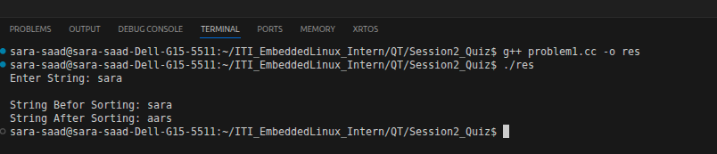
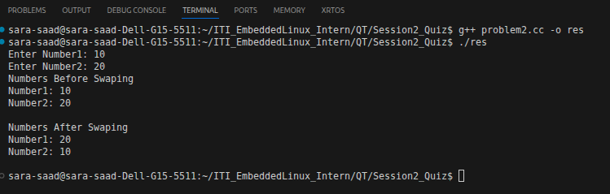
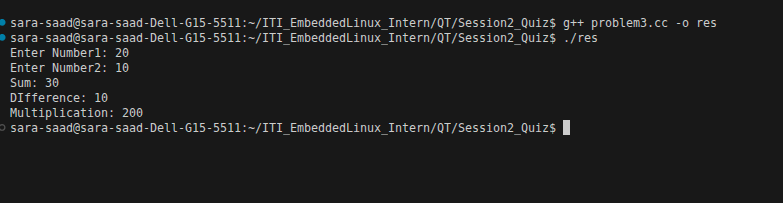

# C++ Bitwise Operations Quiz

A small C++ console program demonstrating classic bit-manipulation tricks:
sorting a string, swapping variables without a temp, and doing arithmetic
without the standard `+`, `-`, or `*` operators.

## Problems

### 1. Sort a String
`sortString(std::string &str)` sorts the characters of a string in place
using a simple selection-sort-style nested loop (O(n²)), swapping any pair
of characters that are out of order.

### 2. Swap Two Numbers Using XOR
`SwapTwoNumbers(unsigned int &num1, unsigned int &num2)` swaps two integers
without a temporary variable, using the classic three-step XOR swap:

```cpp
num1 ^= num2;
num2 ^= num1;
num1 ^= num2;
```

### 3. Arithmetic Using Bitwise Operators
Three functions reimplement basic arithmetic using only bitwise operations:

- **`adding(num1, num2)`** — Addition without `+`. Repeatedly computes the
  carry with AND, the sum-without-carry with XOR, and shifts the carry left
  until there's nothing left to carry.
- **`Subtract(num1, num2)`** — Subtraction without `-`. Same idea as addition,
  but the "borrow" is computed with `(~num1) & num2`.
- **`Multiply(num1, num2)`** — Multiplication without `*`. Uses the standard
  binary long-multiplication approach: for each set bit in `num2`, add a
  left-shifted copy of `num1` to the result (reusing the `adding` function
  above), similar to how multiplication works on paper in binary.

## How It Works (`main`)

The program runs all three problems interactively:

1. Prompts for a string, prints it before/after `sortString`.
2. Prompts for two numbers, prints them before/after `SwapTwoNumbers`.
3. Prompts for two more numbers, then prints their sum, difference, and
   product computed via the bitwise functions.

## Build & Run

```bash
g++ -std=c++17 -o bitwise_quiz main.cpp
./bitwise_quiz
```
---

## OUtPut
### Task1


### Task2


### Task3


## Notes / Caveats

- `Subtract` assumes `num1 >= num2`; with unsigned integers, subtracting a
  larger number from a smaller one will underflow/wrap around rather than
  produce a negative result.
- `sortString` is O(n²) — fine for short strings/learning purposes, not
  meant for large inputs.
- These implementations are educational, showing how arithmetic and swapping
  can be built from bitwise primitives (`&`, `|`, `^`, `~`, `<<`, `>>`)
  rather than relying on built-in operators.