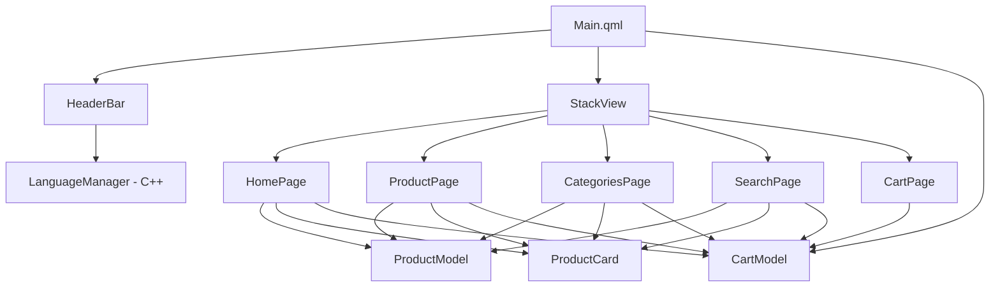

# 🛒 Electronics Shop – Qt/QML Desktop Application

A modern desktop electronics shopping application built with **Qt 6** and **QML**, featuring product browsing, category filtering, keyword search, shopping cart management, multilingual support, and a reusable, component-based UI architecture.

---

##  Table of Contents

- [Project Overview](#-project-overview)
- [Project Goals](#-project-goals)
- [Main Features](#-main-features)
- [Application Pages](#-application-pages)
- [Technology Stack](#-technology-stack)
- [Project Architecture](#-project-architecture)
- [Project Structure](#-project-structure)
- [Getting Started](#-getting-started)
- [Internationalization Workflow](#-internationalization-workflow)
- [Notes & Limitations](#-notes--limitations)

---

## 📖 Project Overview

**Electronics Shop** is a desktop application that simulates an online electronics store, built entirely with **Qt Quick / QML** on top of a small **C++** backend layer. It was developed as part of an **ITI Embedded Linux training** program, with the goal of practicing modern Qt/QML application design: page-based navigation, reusable UI components, in-memory data models, and localized user interfaces.

The application lets a user:

- Browse a catalog of electronic components, robotics parts, development boards, sensors, and tools
- Explore products organized by category
- Search the catalog by product name, category, brand, version, or interface
- View detailed product specifications (brand, version, color, voltage, interface) via a flip-card interaction
- Add products to a shopping cart
- Increase or decrease item quantities, or remove items from the cart
- Review cart totals and per-item totals
- Confirm an order through a checkout popup
- Switch the interface language between English, Arabic, French, and German at runtime

It is a **single-window desktop application** (not a mobile or web app), built using `QGuiApplication` and `QQmlApplicationEngine`, and demonstrates a clean separation between the QML presentation layer and the C++ translation-management layer.

---

##  Project Goals

This project was built to practice and demonstrate the following concepts:

- **Qt 6 application development** — structuring a QML application around `QGuiApplication` and `QQmlApplicationEngine`, loaded via a Qt QML module (`engine.loadFromModule`).
- **QML UI development** — building complex, responsive layouts using `Page`, `ColumnLayout`, `RowLayout`, `GridLayout`, and `ScrollView`.
- **JavaScript logic inside QML** — implementing filtering, searching, and cart calculations as JavaScript functions attached to QML `ListModel` objects.
- **Reusable QML components** — extracting shared UI pieces (`HeaderBar`, `ProductCard`) so they can be reused across multiple pages.
- **Signals and properties** — using custom signals (`addToCartClicked`, `categoryClicked`, `languageSelected`, etc.) to decouple components from the logic that reacts to them.
- **Models and data handling** — representing both the product catalog and the shopping cart as `ListModel` subclasses with custom query and mutation functions.
- **StackView navigation** — implementing page-to-page navigation from a single application shell (`Main.qml`).
- **Multiple pages with a shared shell** — Home, Products, Categories, Search, and Cart pages that all plug into the same `HeaderBar` and `StackView`.
- **Search functionality** — implementing a simple in-memory search over multiple product fields.
- **Shopping cart management** — quantity tracking, per-item and cart-wide totals, and a checkout confirmation flow.
- **Responsive layouts** — using Qt Quick Layouts so grids and rows adapt to the window size.
- **Qt Quick Controls** — buttons, text fields, and popups styled with custom backgrounds (`QtQuick.Controls.Basic`).
- **Internationalization (i18n)** — translating the UI using `qsTr()`, Qt Linguist `.ts` files, and a dedicated `LanguageManager` C++ class.
- **Clean UI architecture** — separating pages, reusable components, and data models into distinct QML files.
- **Separation of UI and application logic** — keeping translation/runtime-language switching in C++ (`LanguageManager`) while all visual logic stays in QML.

---

##  Main Features

###  Home Page

The landing page (`HomePage.qml`) includes:

- A full-width **hero section** with a background image (`electronics_bg.png`), a dark overlay, a headline, a subtitle, and an **"Explore Products"** call-to-action button.
- A **category selector** rendered as a row of five clickable cards (Electronic Components, Robotics, Development Boards, Sensors, Electronic Tools), each with an icon and label.
- A **product grid** that adapts based on state:
  - By default, shows up to 12 **popular products** (the first items in the catalog).
  - If a category is selected, shows up to 6 products from that category, with a **"Show All →"** button to reveal the full category.
  - A **"Return"** button resets the view back to the popular-products state.
- Each product is rendered using the reusable `ProductCard` component, and clicking **Add** appends the product to the shared cart model.

###  Product Browsing

`ProductPage.qml` displays the **entire product catalog** in a responsive 6-column grid, using the same `ProductCard` component as the rest of the app. Every product includes:

- Name, image, and price
- Category and availability (`productAvailable`)
- Extended specifications: **Brand**, **Version**, **Color**, **Voltage**, and **Interface**

These fields are defined per product in `ProductModel.qml` and exposed to each `ProductCard` instance.

### 🔎 Search

`SearchPage.qml` provides a dedicated search experience:

- A hero section with a `TextField` for entering a search query and a **Search** button.
- Searching can be triggered either by clicking the button or by pressing **Enter/Return** inside the field (`Keys.onReturnPressed`).
- The search is delegated to `ProductModel.searchProducts()`, which performs a case-insensitive match against **product name, category, brand, version, and interface**.
- A **results count** label shows how many products matched the query.
- Matching products are displayed in the same grid/card layout used elsewhere in the app.
- An **empty-state view** (a search icon, "No products found", and a helper message) is shown when a query returns zero results.

###  Categories

`CategoriesPage.qml` lets users browse the catalog by category:

- A grid of the five category cards, matching the ones on the Home page.
- Selecting a category highlights it and reveals a **"Products in `<category>`"** heading.
- The products grid below is populated via `ProductModel.getProductsByCategory()`, which returns **all** products in the selected category (no artificial limit, unlike the Home page's default view).

###  Shopping Cart

`CartPage.qml` manages the cart experience:

- An **empty-cart state** with an icon, "Your cart is empty" message, and helper text, shown when the cart has no items.
- A scrollable list of cart line items, each showing the product image, name, category, unit price, and quantity controls.
- **Quantity controls** — `+`/`−` buttons that call `increaseQuantity()` / `decreaseQuantity()` on the cart model; decreasing below a quantity of 1 removes the item entirely.
- A **remove button** (`×`) that deletes the item from the cart outright.
- A **per-item total** (`productTotal()`) and a running **items-in-cart** count (`totalItems()`).
- A **Checkout** button that opens a confirmation `Popup` showing "Order Confirmed!", the final cart total (`cartTotal()`), and a **Close** button that clears the cart and returns the user to the Home page.

###  Multilingual Support

The application supports **English, Arabic, French, and German**, switchable at runtime from a language popup in the header.

The translation mechanism works as follows:

1. All user-facing strings in QML are wrapped in `qsTr()`.
2. Qt Linguist `.ts` files (`Session4_Task_ElectronicsShop_en.ts`, `_ar.ts`, `_fr.ts`, `_de.ts`) hold the source strings and their translations, organized by QML component context (`CartPage`, `CategoriesPage`, `HeaderBar`, `HomePage`, `Main`, `ProductCard`, `ProductPage`, `SearchPage`).
3. `qt_add_translations()` in `CMakeLists.txt` compiles these `.ts` files into `.qm` binaries and embeds them into the application's Qt resource system under `/qt/qml/Session4Task_ElectronicsShop/i18n/`.
4. On the C++ side, `LanguageManager::setLanguage(language)`:
   - Removes any previously installed `QTranslator`.
   - For Arabic, French, or German, loads the corresponding compiled `.qm` file into a `QTranslator` and installs it on the application via `app->installTranslator()`.
   - For English (the source language), no translator is installed — the previous one is simply removed.
   - In every case, it calls `engine->retranslate()` on the `QQmlApplicationEngine` so all active `qsTr()` bindings in QML are re-evaluated, then emits a `languageChanged()` signal.
5. On the QML side, the `LanguageManager` instance is exposed to the engine as the context property `languageManager` (set up in `main.cpp`). `HeaderBar`'s language popup calls `languageManager.setLanguage("ar" | "fr" | "de" | "en")` when a language is selected.

This means translation refresh is handled explicitly through `engine->retranslate()` rather than QML automatically re-evaluating `qsTr()` calls on its own — the C++ layer is responsible for triggering the UI refresh after a language change.

---

##  Application Pages

| File | Responsibility |
|------|-----------------|
| `Main.qml` | Application shell: hosts the `StackView` and `HeaderBar`, owns the shared `CartModel` instance, and wires navigation signals to page pushes. |
| `HomePage.qml` | Landing page with a hero section, category selector, and a popular/all-products grid. |
| `ProductPage.qml` | Displays the full product catalog in a grid. |
| `CategoriesPage.qml` | Category selector plus a grid of all products in the selected category. |
| `SearchPage.qml` | Search input and results grid, with an empty-results state. |
| `CartPage.qml` | Displays cart contents, manages quantities, and handles checkout. |
| `components/HeaderBar.qml` | Top navigation bar: logo, Home/Products/Categories links, search and cart buttons, and the language-selection popup. |
| `components/ProductCard.qml` | Reusable flip-card component showing product summary (front) and detailed specs (back). |
| `model/ProductModel.qml` | `ListModel` holding the hardcoded product catalog, plus category-filtering and search functions. |
| `model/CartModel.qml` | `ListModel` holding cart line items, plus quantity, total, and clear-cart functions. |
| `LanguageManager.h` / `.cpp` | C++ class that loads/installs `QTranslator` instances and triggers QML retranslation. |
| `main.cpp` | Application entry point; creates the engine, instantiates `LanguageManager`, and loads `Main.qml`. |

---

##  Technology Stack

| Technology | Usage |
|------------|-------|
| **Qt 6** (6.10+) | Core application framework (`QGuiApplication`, `QQmlApplicationEngine`). |
| **QML / Qt Quick** | Declarative UI for all pages and components. |
| **JavaScript** | In-QML logic for product filtering, search, and cart calculations (inside `ProductModel.qml` and `CartModel.qml`). |
| **Qt Quick Controls (Basic style)** | Buttons, text fields, and popups (`QtQuick.Controls.Basic`). |
| **Qt Quick Layouts** | `ColumnLayout`, `RowLayout`, `GridLayout` for responsive positioning. |
| **C++** | `LanguageManager` class, handling `QTranslator` loading and engine retranslation. |
| **CMake** | Build system, using `qt_add_executable`, `qt_add_qml_module`, and `qt_add_translations`. |
| **Qt Linguist / `.ts` files** | Source of translatable strings and their Arabic, French, and German translations. |
| **Qt Resource System** | Embeds product images, the logo, and compiled `.qm` translation files into the binary. |
| **StackView** | Page-to-page navigation from the application shell. |

---

##  Project Architecture

The application is organized into five conceptual layers:

1. **Entry point** — `main.cpp` bootstraps the `QGuiApplication` and `QQmlApplicationEngine`, creates the `LanguageManager`, exposes it to QML as `languageManager`, and loads `Main.qml` as the root QML module.
2. **Application shell** — `Main.qml` owns the single shared `CartModel` instance and a `StackView`. It also hosts `HeaderBar`, translating its navigation signals (`homeClicked`, `productsClicked`, `categoriesClicked`, `searchClicked`, `cartClicked`, `languageSelected`) into `stackView.push(...)` calls or `languageManager.setLanguage(...)` calls.
3. **Pages** — `HomePage`, `ProductPage`, `CategoriesPage`, `SearchPage`, and `CartPage` are pushed onto the `StackView` as needed. Each page (aside from the cart) receives the shared `cartModel` as a property and instantiates its own local `ProductModel` for reading the catalog.
4. **Reusable components** — `ProductCard` is used by every page that displays products; `HeaderBar` is used once, in `Main.qml`, and stays visible across all pages.
5. **Data layer** — `ProductModel` (static catalog + search/filter functions) and `CartModel` (cart state + quantity/total functions) are both QML `ListModel` subclasses, keeping data and data-manipulation logic together in JavaScript rather than in C++.

Signals are the primary communication mechanism between components: `ProductCard` emits `addToCartClicked()`, which each page's `Repeater` delegate handles by calling `cartModel.addProduct(modelData)`; `HeaderBar` emits navigation signals that `Main.qml` handles by pushing new pages; `HomePage` emits `exploreProductsClicked()` and `categoryClicked(name)`, which `Main.qml` handles to navigate to `ProductPage` or `CategoriesPage` with the right initial state.



---

##  Project Structure

```
Session4Task_ElectronicsShop/
├── CMakeLists.txt
├── main.cpp
├── LanguageManager.h
├── LanguageManager.cpp
├── Main.qml
├── HomePage.qml
├── ProductPage.qml
├── CategoriesPage.qml
├── SearchPage.qml
├── CartPage.qml
├── components/
│   ├── HeaderBar.qml
│   └── ProductCard.qml
├── model/
│   ├── ProductModel.qml
│   └── CartModel.qml
├── imags/
│   ├── electronics_bg.png
│   ├── logo.png
│   └── ... (individual product images)
└── i18n/
    ├── Session4_Task_ElectronicsShop_en.ts
    ├── Session4_Task_ElectronicsShop_ar.ts
    ├── Session4_Task_ElectronicsShop_fr.ts
    └── Session4_Task_ElectronicsShop_de.ts
```

> The product catalog defined in `ProductModel.qml` contains **49 products** spread across five categories: Development Boards, Electronic Components, Electronic Tools, Robotics, and Sensors.

---

##  Getting Started

### Prerequisites

- Qt **6.10** or later, with the **Quick** and **LinguistTools** components installed.
- CMake **3.16+**.
- A C++ compiler compatible with your Qt installation (MSVC, MinGW, GCC, or Clang).

### Build

```bash
cmake -S . -B build
cmake --build build
```

### Run

Run the generated `appSession4Task_ElectronicsShop` executable from the build output directory (its exact path depends on your platform and generator).

---

##  Internationalization Workflow

If you modify or add translatable strings in QML:

1. Wrap the string in `qsTr("...")`.
2. Regenerate/update the `.ts` files using Qt's `lupdate` (wired up automatically through `qt_add_translations` in `CMakeLists.txt` when the project is rebuilt).
3. Open the `.ts` files in **Qt Linguist** and provide translations for Arabic, French, and German (English is the source language and requires no translation).
4. Rebuild the project — `qt_add_translations()` compiles the `.ts` files into `.qm` files and bundles them into the application's resources automatically.

---

##  Notes & Limitations

- The product catalog and cart are both **in-memory `ListModel` data** — there is no persistence, database, or network layer. Restarting the application resets the cart and always reloads the same static catalog.
- Checkout is a **UI-only confirmation flow**: closing the confirmation popup clears the cart and returns to the Home page, but no order data is stored or transmitted anywhere.
- The **"Language"** label in the header's language popup is present in the source `.ts` files but left untranslated (`unfinished`) in the Arabic, French, and German translation files at the time of writing.