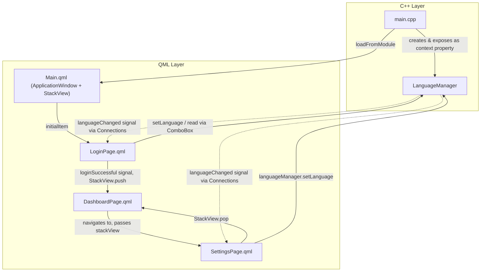

# 🏠 Smart Home Control Dashboard with Qt/QML

A desktop smart-home control panel built with **Qt 6 / QML**, featuring a login flow, a device dashboard, a settings screen, and full **English / Arabic / French** localization driven by a C++ backend class.

---

## 📖 Project Overview

The **Smart Home Control Dashboard** is a Qt Quick (QML) desktop application that simulates the control panel of a smart home. It was developed as part of the **Embedded Linux training program at the Information Technology Institute (ITI)**, with a focus on building modern, declarative GUIs using **Qt/QML** and integrating them with a **C++ backend**.

The application lets a user:

- Log in through a styled authentication screen (client-side simulated login).
- Navigate to a smart-home dashboard (device overview).
- Open a settings screen to adjust brightness, room/heater temperature, notifications, and toggle individual smart devices.
- Switch the entire application's language at runtime between **English, Arabic, and French**, with all UI text updating immediately without restarting the app.

The project's purpose is educational: it demonstrates practical Qt Quick UI composition, QML/C++ interoperability via `Q_INVOKABLE` methods and signals, `StackView`-based page navigation, and Qt's built-in localization pipeline (`qsTr()`, `.ts`/`.qm` files, `QTranslator`).

> ⚠️ **Note on scope:** Device toggles, sliders, and dials in this app represent the *UI* for smart-home control. There is no real hardware, network, or IoT protocol behind them — actions are simulated and logged to the console (see [Features](#-features) and [Future Improvements](#-future-improvements)).

---

## 🖼️ Project Demo / Screenshots

No screenshot files were found in the repository at the time of writing. Add screenshots of the running application here, for example:

| Screen | Preview |
|---|---|
| Login Screen | `docs/screenshots/login.png` |
| Dashboard | `docs/screenshots/dashboard.png` |
| Settings | `docs/screenshots/settings.png` |
| Language Selection (Arabic) | `docs/screenshots/settings-arabic.png` |
| Language Selection (French) | `docs/screenshots/settings-french.png` |

```markdown


```

*(Create a `docs/screenshots/` folder, add PNGs of each screen, and update the paths above.)*

---

## ✨ Features

Based strictly on what is implemented in the source files:

- **Login screen** with username/password fields, client-side validation (both fields required), a simulated 2-second "authenticating" delay via a `Timer`, and a `BusyIndicator` loading state.
- **Page navigation** between Login → Dashboard → Settings using a shared `StackView`.
- **Settings screen** with:
  - Application language selector (`ComboBox`: English / Arabic / French).
  - Screen brightness control (`Slider`, 0–100%).
  - Room temperature control (`Dial`, 16–35 °C).
  - "Enable Notifications" toggle (`CheckBox`).
  - Smart device toggles: **Security Camera**, **Smart TV**, **Washing Machine**, **Smart Door Lock** (`CheckBox` controls with custom checkmark indicators).
  - Heater temperature control (`Dial`, 18–30 °C).
  - "Save Settings" action that logs the current state of every control to the console (no persistence layer).
  - "Back to Dashboard" navigation button that pops the `StackView`.
- **Runtime, app-wide language switching** (English/Arabic/French) that updates already-visible screens immediately, implemented through a custom C++ `LanguageManager` class exposed to QML.
- **Custom-styled UI controls**: hand-drawn backgrounds/handles for `Slider`, `Dial`, and `CheckBox` (rather than default platform styling), custom animated login card, and an animated ambient glow effect on the login background.
- **Reusable custom checkbox visuals**: every `CheckBox` (Notifications, Security Camera, Smart TV, Washing Machine, Smart Door Lock) follows the same custom `indicator`/checkmark pattern.

---

## 🛠️ Technologies & Tools

| Technology / Tool | Purpose |
|---|---|
| **C++** | Application entry point and `LanguageManager` backend logic |
| **Qt 6** (`Qt6::Quick`) | GUI/application framework |
| **QML** | Declarative UI for all screens |
| **Qt Quick** | Core visual items (`Rectangle`, `Image`, `Text`, animations) |
| **Qt Quick Controls** (`QtQuick.Controls` / `QtQuick.Controls.Basic`) | `Button`, `TextField`, `ComboBox`, `Slider`, `Dial`, `CheckBox`, `Label`, `Page`, `ApplicationWindow`, `StackView`, `BusyIndicator`, `ScrollView` |
| **Qt Quick Layouts** | `RowLayout`, `ColumnLayout` for responsive arrangement |
| **Qt Linguist tools / `.ts` files** | Source-string extraction and translation (`Session3_Task_en.ts`, `_ar.ts`, `_fr.ts`) |
| **QTranslator (Qt i18n runtime)** | Loading compiled `.qm` translations at runtime |
| **CMake** (`Qt6::qt_add_qml_module`, `qt_add_translations`) | Build system, QML module and translation packaging |
| **Qt Resource System** | Embedding images and compiled translations (`.qm`) into the binary |
| **Git / GitHub** | Version control & repository hosting |

Only tools that appear in `CMakeLists.txt`, the `.qml`/`.cpp` sources, or the `.ts` files are listed above.

---

## 🧩 Qt / QML Technologies Used

### `QtQuick`
Used in every `.qml` file for the fundamental building blocks: `Rectangle`, `Image`, `Text`, `Item`, `Timer`, `Connections`, and property animations (`NumberAnimation`, `SequentialAnimation`, `ParallelAnimation`) — e.g., the animated glow circle and the fade/scale-in of the login card in `LoginPage.qml`.

### `QtQuick.Controls` / `QtQuick.Controls.Basic`
`Main.qml` and `LoginPage.qml` import `QtQuick.Controls.Basic`; `SettingsPage.qml` imports `QtQuick.Controls`. Controls actually used across the app:

- `ApplicationWindow` — the top-level window (`Main.qml`).
- `StackView` — page navigation container (`Main.qml`, referenced by `SettingsPage.qml`).
- `Page` — base type for `LoginPage.qml` and `SettingsPage.qml`.
- `Label` — all headings/section text.
- `TextField` — username and password inputs.
- `Button` — Login, Exit, Save Settings, Back to Dashboard.
- `ComboBox` — language selector.
- `Slider` — screen brightness.
- `Dial` — room temperature and heater temperature.
- `CheckBox` — notifications and every smart-device toggle.
- `BusyIndicator` — login loading spinner.
- `ScrollView` — scrollable container wrapping the entire Settings page content.

### `QtQuick.Layouts`
Used in `LoginPage.qml` and `SettingsPage.qml`:

- `RowLayout` — the two-column login screen layout (branding side + login card).
- `ColumnLayout` — vertical stacking of login form fields and of every settings section.
- `Layout.fillWidth`, `Layout.fillHeight`, `Layout.preferredWidth/Height`, `Layout.alignment`, `Layout.topMargin`/`bottomMargin` — used throughout for spacing and sizing.
- Plain `anchors` (`anchors.fill`, `anchors.centerIn`, `anchors.horizontalCenter`, etc.) are used alongside layouts for backgrounds, overlays, and precise positioning (e.g., the login page's background image and glow effect).

---

## 🧱 QML Components

### `Main.qml`
- **Purpose:** Application root window and navigation host.
- **Main elements:** `ApplicationWindow` (1000×700, background `#F4F7FB`, window title from `qsTr("Smart Home Control Dash Board")`) containing a single `StackView`.
- **Behavior:** Sets `LoginPage` as `initialItem`. Listens for the `LoginPage`'s `loginSuccessful` signal and, on success, pushes `DashboardPage.qml` onto the `StackView`, passing itself (`stackView: stackview_id`) as a property so the dashboard/settings pages can navigate back.
- **Communication:** Connects to `LoginPage` via its custom signal; passes the `StackView` reference forward to `DashboardPage.qml`.

### `LoginPage.qml`
- **Purpose:** Authentication entry screen with simulated login.
- **Main UI elements:** Animated background image (`images/smart_home_background.png`) with a dark overlay and an animated cyan "glow" circle; a branding column (`SMART` / `HOME` labels); a card (`loginCard`) containing a user icon (`images/user.png`), title/subtitle labels, username `TextField`, password `TextField` (`echoMode: TextInput.Password`), an error `Label`, a `Login` `Button`, an `Exit` `Button`, and a `BusyIndicator`.
- **Properties:** `isLoading` (bool) — disables the Login button and drives the busy indicator during the simulated authentication delay.
- **Signals:** `loginSuccessful()` — emitted after a successful (simulated) login.
- **Functions:** `updateTexts()` — re-assigns every visible label/placeholder using `qsTr()` so text refreshes when the language changes.
- **Interactions:** Login is accepted once both fields are non-empty; a 2-second `Timer` (`loginTimer`) simulates a network/auth call, after which `loginSuccessful()` fires. Empty fields show a validation message. The Exit button calls `Qt.quit()`.
- **Language integration:** A `Connections` block listens to the global `languageManager.languageChanged` signal and calls `updateTexts()` to refresh all strings.

### `SettingsPage.qml`
- **Purpose:** Central control panel for display, climate, notification, and per-device settings.
- **Main UI elements:** A `ScrollView`-wrapped `ColumnLayout` containing: title label, language `ComboBox`, brightness `Slider`, room-temperature `Dial`, notifications `CheckBox`, a "Smart Devices" section with `CheckBox` controls for Security Camera, Smart TV, and Washing Machine, a heater-temperature `Dial`, a Smart Door Lock `CheckBox`, a "Save Settings" `Button`, and a "Back to Dashboard" `Button`.
- **Properties:** `stackView` (StackView reference, set by the caller for back-navigation) and `languageVersion` (int) — an internal counter incremented on every language change purely to force QML's binding engine to re-evaluate each `text:` block (each label's binding reads `settingsPage.languageVersion` before returning its `qsTr()` string, which creates a dependency that re-triggers the binding).
- **Interactions:** Selecting a language in the `ComboBox` calls `languageManager.setLanguage(...)`. Moving the brightness `Slider` or either `Dial` logs the new value. Every `CheckBox` toggle logs its new state. "Save Settings" logs a full snapshot of every control's current value to the console (there is no real persistence). "Back to Dashboard" calls `stackView.pop()`.
- **Language integration:** A `Connections` block listens for `languageManager.languageChanged`, increments `languageVersion`, and rebuilds the language `ComboBox`'s model with freshly translated strings.

### `DashboardPage.qml` *(referenced but not included in the reviewed source set)*
This file is declared in `CMakeLists.txt` (`QML_FILES`) and is pushed onto the `StackView` from `Main.qml` after a successful login, and it also has its own translation context (`DashboardPage`) inside the `.ts` files. Based on the translated source strings, it presents a dashboard titled **"Smart Home Dashboard"**, individual device tiles (Living Room Light, Bedroom Light, Kitchen Light, Air Conditioner, Fan, Garage Door, Heater, Smart TV, Washing Machine, Smart Door Lock) each with an **ON/OFF** state label, plus **Settings** and **Logout** actions. Its exact QML implementation was not part of the reviewed files, so it is intentionally not documented in further detail here — update this section once the file is added to the reviewed source.

### Reusable visual patterns
- **Custom `CheckBox` styling** — the same custom `indicator` (rounded square + "✓" glyph) and `contentItem` pattern is repeated for every checkbox (Notifications, Security Camera, Smart TV, Washing Machine, Smart Door Lock) instead of a single shared component — a good candidate for extraction into a reusable component (see [Future Improvements](#-future-improvements)).
- **Custom `Slider`/`Dial` styling** — brightness and both temperature dials use hand-styled `background`/`handle` delegates rather than the platform defaults.

---

## 🏗️ Application Architecture

- **Entry point (`main.cpp`):** Creates the `QGuiApplication` and `QQmlApplicationEngine`, instantiates a single `LanguageManager` object, and exposes it to all QML files as the context property `languageManager` via `engine.rootContext()->setContextProperty(...)`. The root QML module is then loaded with `engine.loadFromModule("Session3_Task", "Main")` (the Qt 6 CMake QML module system, not a plain file path).
- **QML layer:** `Main.qml` hosts a `StackView` that swaps between `LoginPage.qml`, `DashboardPage.qml`, and `SettingsPage.qml`.
- **C++ layer (`LanguageManager`):** A `QObject` subclass holding a single `QTranslator`. Its `Q_INVOKABLE setLanguage(QString)` method removes any previously installed translator, loads the requested compiled translation from the Qt resource system (for Arabic/French) or falls back to the source (English) strings, and then emits `languageChanged()`.
- **C++ ⇄ QML communication:**
  - **C++ → QML exposure:** `languageManager` is registered as a context property, making it directly callable from any QML file.
  - **QML → C++:** QML calls `languageManager.setLanguage("Arabic" | "French" | "English")` (from `SettingsPage.qml`'s `ComboBox`).
  - **C++ → QML notification:** `LanguageManager::languageChanged()` is a Qt signal; each page uses a `Connections { target: languageManager }` block to react to it.
- **State/translation refresh pattern:** Because QML `text: qsTr(...)` bindings are evaluated once at binding-creation time, the app manually re-triggers translation on each page after a language switch — either by explicitly re-calling `qsTr()` inside an `updateTexts()` function (`LoginPage.qml`) or by incrementing a dummy property that the text bindings depend on (`SettingsPage.qml`'s `languageVersion`).
- **Navigation state:** Handled entirely by `StackView.push()` / `StackView.pop()`; the `stackView` reference is passed down explicitly as a QML property rather than through a singleton or global state.



---

## 🧭 Navigation Flow

```text
Application Start
       |
       v
   Login Page  (LoginPage.qml)
       | (validated username/password + simulated auth delay)
       v
   Dashboard    (DashboardPage.qml)
       |
       v
   Settings     (SettingsPage.qml)
       |
       | (Back to Dashboard button -> stackView.pop())
       v
   Dashboard    (DashboardPage.qml)
```

All navigation is implemented with a single shared `StackView` (`stackview_id`, created in `Main.qml`):
- `LoginPage → DashboardPage`: triggered by the `loginSuccessful()` signal, handled in `Main.qml` with `stackview_id.push("DashboardPage.qml", { stackView: stackview_id })`.
- `Dashboard → Settings` and `Settings → Dashboard`: `SettingsPage.qml` receives the same `stackView` reference as a property and calls `stackView.pop()` from its "Back to Dashboard" button. (The push from Dashboard into Settings happens inside `DashboardPage.qml`, which was not part of the reviewed source files.)

---

## 🌐 Localization / Multilingual Support

**Supported languages:** English (source language), Arabic (`ar_EG`), French (`fr_FR`).

**Translation source files (`i18n/`):**
- `Session3_Task_en.ts` — empty (English is the source language; no translations needed, `qsTr()` returns the literal source text).
- `Session3_Task_ar.ts` — Arabic translations for `DashboardPage`, `LoginPage`, `Main`, and `SettingsPage` contexts.
- `Session3_Task_fr.ts` — French translations for the same four contexts.

**Build pipeline:** `CMakeLists.txt` declares the source and translated languages via `qt_standard_project_setup(I18N_SOURCE_LANGUAGE en I18N_TRANSLATED_LANGUAGES ar fr)`, and `qt_add_translations(appSession3_Task TS_FILE_BASE Session3_Task TS_FILE_DIR i18n RESOURCE_PREFIX /qt/qml/Session3_Task/i18n)` compiles the `.ts` files into `.qm` binaries and embeds them into the application's Qt resources under `/qt/qml/Session3_Task/i18n/`.

**Runtime switching (`LanguageManager`):**
1. QML calls `languageManager.setLanguage("Arabic" | "French" | "English")`.
2. `LanguageManager::setLanguage()` removes any currently installed `QTranslator` (`QCoreApplication::removeTranslator`).
3. For Arabic/French, it loads the matching compiled resource (e.g. `:/qt/qml/Session3_Task/i18n/Session3_Task_ar.qm`) and installs it (`QCoreApplication::installTranslator`); for English, no translator is installed, so `qsTr()` falls back to the literal source strings.
4. `languageChanged()` is emitted.
5. Each QML page listens via a `Connections { target: languageManager }` block and refreshes its own visible text — `LoginPage.qml` by re-invoking `qsTr()` inside a dedicated `updateTexts()` function, `SettingsPage.qml` by bumping a `languageVersion` counter that every text-producing binding depends on, forcing QML to re-evaluate those bindings (and therefore `qsTr()`) with the newly installed translation active.

**`qsTr()` usage:** Every user-facing string in `Main.qml`, `LoginPage.qml`, and `SettingsPage.qml` is wrapped in `qsTr(...)`, which is what makes those strings discoverable by Qt Linguist's `lupdate` tool and translatable at runtime.

**RTL / right-to-left layout:** The `.ts` files provide Arabic *text* translations, but no `LayoutMirroring`, mirrored anchors, or other RTL-specific layout logic was found in the reviewed QML. Arabic content therefore displays as translated text within the existing (left-to-right) layout — full RTL mirroring is not currently implemented (see [Future Improvements](#-future-improvements)).

---

## 🔌 Smart Home Features

The following controls exist in the actual implementation (`SettingsPage.qml`); each is a simulated toggle/value with no real device connection:

### Lighting
Not directly controlled from `SettingsPage.qml`. Individual room lights (Living Room, Bedroom, Kitchen) appear only as translated labels tied to `DashboardPage.qml`, which was not included in the reviewed source.

### Climate Control
- **Room Temperature** — a `Dial` (16–35 °C, default 24 °C) on the Settings page; the current value is shown live in the section label and logged to the console on change.
- **Heater Temperature** — a separate `Dial` (18–30 °C, default 22 °C) with the same live-label and console-log behavior.
- **Screen Brightness** — a `Slider` (0–100%, default 70%) with a live percentage label.

### Notifications
An "Enable Notifications" `CheckBox` (default: checked) that toggles a boolean state, logged on change.

### Device Toggles
- **Security Camera** — `CheckBox`, default checked.
- **Smart TV** — `CheckBox`, default checked.
- **Washing Machine** — `CheckBox`, default *unchecked*.
- **Smart Door Lock** — `CheckBox`, default checked.

Each toggle uses a custom-drawn indicator (rounded square that fills with the app's accent color `#00A6D6` and shows a "✓" when checked) rather than the platform's default checkbox style.

### Saving Settings
The "Save Settings" button does not persist anything to disk or a backend — it prints a full snapshot of every control's current value (language, brightness, room temperature, notifications, camera/TV/washing-machine state, heater temperature, door-lock state) to the console, clearly labeled as a simulation.

---

## 🎨 UI/UX Design

- **Color palette:** A cool blue/cyan accent (`#00A6D6` / `#00D9FF` / `#00CFFF`) over neutral backgrounds (`#F4F7FB` app background, `#F8FAFC` cards) with dark slate text (`#1F2937` / `#102A43` / `#374151`) and a red (`#EF4444`/`#DC2626`) accent reserved for the Exit action and validation errors.
- **Cards & elevation:** The login form is presented as a rounded (`radius: 22`), semi-transparent card with a separate offset `Rectangle` behind it used purely as a soft drop-shadow.
- **Rounded corners & consistent radii:** Buttons, text fields, the language `ComboBox`, and all checkboxes share the same ~8–9 px corner radius for visual consistency.
- **Typography:** A clear size hierarchy — large bold branding text (`HOME`, 58 px) down to section labels (20 px, bold) and body/control labels (14–15 px).
- **Motion/feedback:** The login card fades and scales in on load (`SequentialAnimation`/`ParallelAnimation`), an ambient glow circle drifts side-to-side in an infinite loop on the login background, button backgrounds change color on hover/press, and a `BusyIndicator` communicates the simulated login delay.
- **Imagery:** A full-bleed background photo with a dark overlay on the login screen; a circular user-icon badge above the login form; device-related PNG icons bundled as Qt resources (`air_conditioner.png`, `bedroom_light.png`, `fan.png`, `garage_door.png`, `light.png`, `security_camera.png`, `smart_lock.png`, `smart_tv.png`, `thermostat.png`, `washing_machine.png`).
- **Responsive layout:** `RowLayout`/`ColumnLayout` with `Layout.fillWidth`/`fillHeight` on the login screen, and a `ScrollView` + width-clamped (`Math.min(availableWidth, 600)`), centered `ColumnLayout` on the Settings screen so content adapts to the window size while staying readable at wide widths.

---

## 📁 Project Structure

```text
Session3_Task/
├── main.cpp                    # Application entry point; wires LanguageManager into QML
├── LanguageManager.h            # C++ QObject: setLanguage(), languageChanged() signal
├── LanguageManager.cpp
├── Main.qml                     # ApplicationWindow + StackView (navigation root)
├── LoginPage.qml                # Login screen
├── DashboardPage.qml            # Dashboard screen (referenced in CMake/ts files)
├── SettingsPage.qml             # Settings & device-control screen
├── i18n/
│   ├── Session3_Task_en.ts      # English (source language, empty)
│   ├── Session3_Task_ar.ts      # Arabic translations
│   └── Session3_Task_fr.ts      # French translations
├── images/
│   ├── user.png
│   ├── air_conditioner.png
│   ├── bedroom_light.png
│   ├── fan.png
│   ├── garage_door.png
│   ├── light.png
│   ├── smart_home_background.png
│   ├── security_camera.png
│   ├── smart_lock.png
│   ├── smart_tv.png
│   ├── thermostat.png
│   └── washing_machine.png
├── CMakeLists.txt               # Qt6 build & translation configuration
└── README.md
```

**Key files:**
- `main.cpp` — bootstraps the Qt Quick engine and registers the `LanguageManager` as a global QML context property.
- `LanguageManager.{h,cpp}` — the only C++/QML bridge in the project; owns translation loading/switching logic.
- `CMakeLists.txt` — defines the executable, the `Session3_Task` QML module (with its QML files and image resources), and the translation build step (`qt_add_translations`).
- `i18n/*.ts` — Qt Linguist translation source files, compiled to `.qm` and embedded as Qt resources at build time.

---

## ⚙️ Build & Run

### Requirements
- **Qt 6.10 or newer** (enforced by `qt_standard_project_setup(REQUIRES 6.10 ...)` in `CMakeLists.txt`).
- Qt module: **Qt Quick** (`Qt6::Quick`) and **Qt Linguist Tools** (`LinguistTools`, for `.ts` → `.qm` compilation) — both listed in `find_package(Qt6 REQUIRED COMPONENTS Quick LinguistTools)`.
- **CMake ≥ 3.16**.
- A C++ compiler with C++ support matching your installed Qt 6 toolchain (e.g., GCC/Clang on Linux, MSVC on Windows).
- (Optional) **Qt Creator**, for a GUI build/run/debug workflow.

### Build (command line)
```bash
mkdir build
cd build
cmake .. -DCMAKE_PREFIX_PATH=/path/to/Qt/6.x.x/gcc_64   # point to your Qt6 install
cmake --build .
```

### Build & Run (Qt Creator)
1. Open `CMakeLists.txt` in Qt Creator.
2. Select a Qt 6.10+ kit.
3. Click **Build**, then **Run** (▶).

### Run (command line, after building)
```bash
./appSession3_Task
```
*(Executable name comes from `qt_add_executable(appSession3_Task ...)` in `CMakeLists.txt`; on Windows this will be `appSession3_Task.exe`, and on macOS a `.app` bundle is produced due to `MACOSX_BUNDLE TRUE`.)*

---

## 💻 Development Environment

Confirmed from the project configuration:
- **Qt 6** (Quick + LinguistTools modules), **CMake** build system.
- **C++** for the application/backend logic.
- **QML** for all UI.
- **Qt Resource System** for bundling images and compiled translations.

Not confirmed by the repository itself (environment-dependent, not asserted here): specific OS/distribution, IDE, or Qt Creator version used during development — these were part of the ITI Embedded Linux training environment but are not encoded in the source files.

---

## 🧠 Key Qt/QML Concepts Demonstrated

- **Declarative UI composition** — every screen is built from nested QML items and layouts rather than imperative widget code.
- **Properties & custom properties** — e.g., `LoginPage.isLoading`, `SettingsPage.stackView`, `SettingsPage.languageVersion`.
- **Signals & signal handlers** — custom signal `loginSuccessful()`; handled via `onLoginSuccessful` in `Main.qml`; `Connections { function onLanguageChanged() {...} }` pattern used on two pages.
- **`Q_INVOKABLE` C++ methods callable from QML** — `LanguageManager::setLanguage(const QString &)`.
- **Context properties** — `languageManager` registered once in `main.cpp` and used from any QML file without imports.
- **`StackView` navigation** — page pushing/popping with parameter passing (`{ stackView: stackview_id }`).
- **Animations** — `NumberAnimation`, `SequentialAnimation`, `ParallelAnimation` for the login card entrance and the ambient glow loop.
- **`Timer`** — simulates an asynchronous login delay.
- **`qsTr()` and Qt's translation pipeline** — source-string marking, `.ts` translation files, compiled `.qm` resources, and runtime `QTranslator` installation/removal.
- **Manual binding invalidation for retranslation** — the `languageVersion` counter pattern in `SettingsPage.qml`, and the explicit `updateTexts()` re-assignment pattern in `LoginPage.qml`.
- **Qt Resource System** — images and compiled translations embedded into the binary via `qt_add_qml_module(... RESOURCES ...)` and `qt_add_translations(...)`.
- **Custom-styled Qt Quick Controls** — overriding `background`, `handle`, `indicator`, and `contentItem` delegates for `Slider`, `Dial`, `CheckBox`, and `Button` instead of using default platform styling.

---

## 🧩 Challenges & Solutions

- **Runtime language switching without app restart:** Qt Quick's `qsTr()` bindings aren't automatically re-evaluated just because a new `QTranslator` is installed. The project solves this with an explicit `languageChanged()` signal from `LanguageManager`, consumed by each page: `LoginPage.qml` re-runs a dedicated `updateTexts()` function that manually re-assigns every label's text, while `SettingsPage.qml` instead increments a `languageVersion` counter that each text-producing binding reads, forcing QML's binding engine to re-evaluate (and therefore re-translate) those bindings.
- **Cleanly swapping translations:** Before installing a new translator, `LanguageManager::setLanguage()` always calls `QCoreApplication::removeTranslator(&translator)` first, preventing stacked/duplicate translators when a user switches languages repeatedly.
- **Passing navigation context between pages:** Rather than a global navigation singleton, the `StackView` reference is passed explicitly as a property (`stackView: stackview_id`) when pushing `DashboardPage.qml`, letting `SettingsPage.qml` call `stackView.pop()` safely (with a console error guard if the reference is ever missing).
- **Consistent custom control styling:** Because `QtQuick.Controls`/`QtQuick.Controls.Basic` default styling didn't match the intended visual language, every interactive control (`Slider`, `Dial`, `CheckBox`, `Button`, `TextField`) has hand-written `background`/`handle`/`indicator`/`contentItem` delegates for full visual control.

---

## 📚 What I Learned

- Building multi-screen desktop applications with **Qt Quick / QML** and `StackView`-based navigation.
- Bridging **C++ and QML** through context properties, `Q_INVOKABLE` methods, and Qt's signal/slot mechanism.
- Implementing a real **internationalization (i18n) pipeline** with `qsTr()`, `.ts` translation files, `lupdate`/`lrelease` (via CMake's `qt_add_translations`), and runtime `QTranslator` management.
- Handling the practical challenge of **retranslating an already-running UI**, beyond the simple "restart the app" approach.
- Structuring a **CMake-based Qt 6 project** using the modern `qt_add_executable` / `qt_add_qml_module` / `qt_add_translations` APIs.
- Customizing **Qt Quick Controls** visuals (`Slider`, `Dial`, `CheckBox`, `Button`) via delegate overrides rather than relying on default styles.
- Applying **layout and responsive design** principles in QML with `RowLayout`, `ColumnLayout`, and `ScrollView`.
- General **embedded/desktop GUI development practices** as part of the ITI Embedded Linux training track, including project organization and Git-based version control.

---

## 🚀 Future Improvements

The following are realistic next steps and are **not currently implemented**:

- Implementing `DashboardPage.qml`'s device tiles as **reusable QML components** shared with `SettingsPage.qml`'s checkboxes (a single `SmartDeviceToggle` component instead of five near-identical `CheckBox` blocks).
- **Real IoT/device communication** (e.g., MQTT, REST, or a local hardware bridge) instead of console-logged simulated actions.
- **Persisting settings** (e.g., via `QSettings`, a local database, or a config file) so brightness/temperature/device states survive app restarts.
- **Real authentication backend** (currently the login screen only checks that both fields are non-empty; there is no credential verification).
- **True right-to-left (RTL) layout mirroring** for Arabic, using `LayoutMirroring` in addition to the existing text translation.
- **Live sensor data / device state feedback** rather than static default values.
- **User profiles / multi-user support.**
- Extracting the repeated **`Connections` + retranslation pattern** into a shared, reusable QML component or a small translation helper singleton to reduce duplication between pages.
- **Automated tests** (unit tests for `LanguageManager`, QML tests for navigation and control behavior).

---

## 👤 Author

**Sara Saad Mahmoud**
Embedded Linux Trainee – Information Technology Institute (ITI)